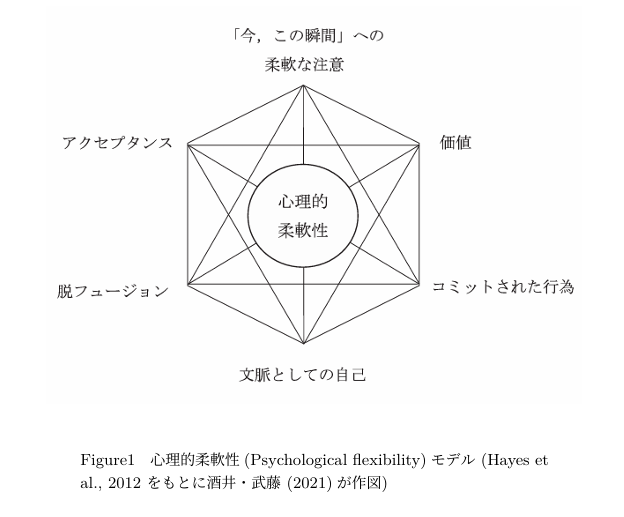
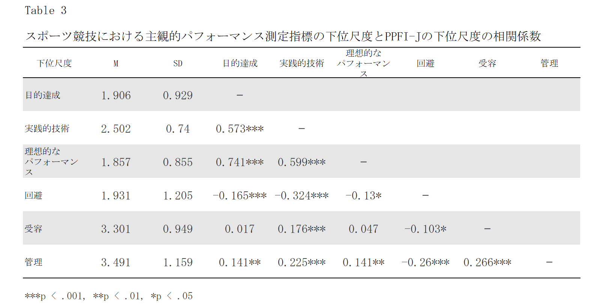
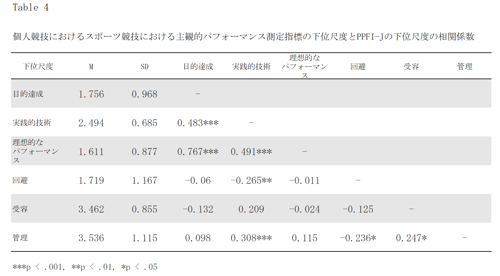
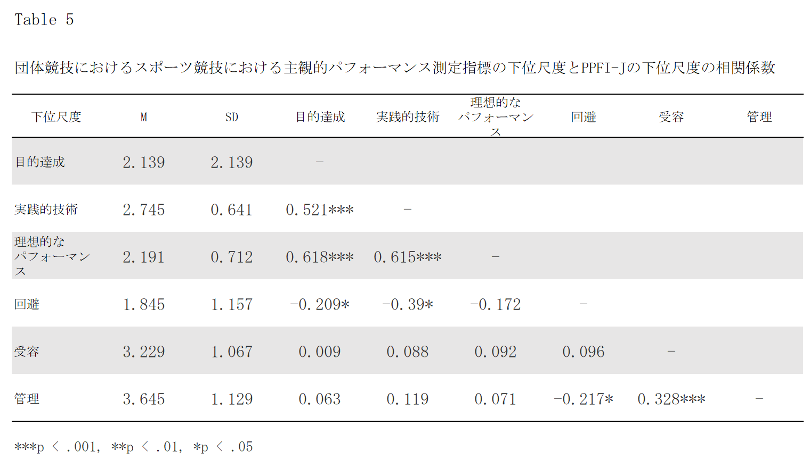

<!-- 
(1) この$\mathit{r}$mdテンプレートを使う際の注意事項
・この上の部分は，「タイトル」の変更と学籍番号・氏名の追加以外は絶対に変更しない。
　変更すると正常に動かなくなります。

・以下に色々と説明が書いてあるので，それにしたがって，書き足していってください。
　作業が進んだら，上の「Knit」を押すと，Rmd→TeX→PDFの変換が自動的になされます。
　このRmdテンプレートを用いた卒論執筆については，以下も参照ください。
　https://kunisatolab.github.io/main/how-to-write-with-rstudio.html

・この<!　 >で囲われた部分は，TeXやPDFには反映されないので，削除しなくても大丈夫です。
　削除しても問題はないので，邪魔になったら削除してもいいです。


(２) 卒論・修論全体の注意事項
1.パラグラフライティングを心がけてください。
　・１パラグラフで述べる主張は１つにしぼる。
　・１パラグラフは，最初に主張，そしてその主張を裏付ける複数の文から構成します。
　・段落を組み合わせることで,論理展開を行う(文を接続詞でつないで，論理展開しない)。
　
2.卒論や修論は，指導教員に向けて書くのではなく，
　その領域に詳しくない人にもわかるように書いてください。
　・前提となる知識を序文で説明する。
　・概念や方法の説明を丁寧にする。
　・略語を多用しない。

3.主語を意識して文章を書く。
　日本語は主語を省略することが多いので，主語が不明確だったり，
　場合によっては主語がブレることがあります。以下を注意ください。
　・今書いている文の主語は何かを意識してください。
　・特に自分の考えた主張なのか，他の研究者の主張なのかは確実に分けてください。
　・パラグラフや全体を通して，主語がぶれてないか注意ください
　　(よくあるのは，他の研究者の主張を書いていて，途中から自分の主張が混ざるとかです)。
-->


<!-- 
Rパッケージの読み込み
卒論で使用するRパケージは，すべてこちらで読み込む(他のチャンクでlibaryを使わない)
-->
```{r message=FALSE, warning=FALSE, include=FALSE}
library(kableExtra)
library(knitr)
library(tidyverse)
library(psych)
library(gridExtra)
library(jtools)
library(ggsignif)
library(qgraph)
library(bootnet)
library(qgraph)
library(networktools)
library(ggplot2)
library(apaTables)
library(dplyr)
library(tidyr)

```

<!-- 
<<< 序文で書くこと >>>
なぜこの研究を行うのか，その重要性を述べるのが序論(Introduction)です。
序論では，それを以下のような順番で書いていきます。
1.その研究領域全体における大きな問題点や事実の指摘
2.少し専門領域にしぼりこんだ上で，先行研究を整理する(何が既にわかっているか？)
3.先行研究の問題点の指摘(何が分かってないか？)
4.本研究での解決策の提案(先行研究で分かってないことをどう調べるか？)
5.本研究の目的
-->

# 序文
## はじめに

<!-- 
「はじめに」で，1.その研究領域全体における大きな問題点や事実の指摘をします。
臨床的問題の場合は，疫学的なデータや疾患による障害度など一般的な背景知識を提示しつつ，
多くの読者が知っている知識から始めて，段々と論点を絞ってください。 
-->

　近年，アスリート自身が自らの心理的問題を発信することが増えている(NHK解説委員会)。それに伴い，国内でもアスリート集団の心理的問題に関するデータが取られ始めている。日本スポーツ振興センター(2018)が行った，女性アスリート支援のための調査研究において，女性アスリートが必要とするサポート内容の一つに「心理面のケア」があるものの，実際の支援状況について回答者の33%が「ほとんど支援されない」と感じており，日本における心理面へのケアの支援体制不足が示唆された。また，学生は競技成績の停滞や学業との両立，卒業後の進路など様々な課題に対応しながら競技を続けることが求められ，これらに上手く対処できない場合，競技生活を揺るがす心理的問題に発展することが指摘されている。具体的には，体育会部活動，サークル活動における失敗体験やスランプ，怪我などが抑うつや不安等のネガティブなストレス反応の原因となりうる。一方で，競技を続ける学生に対するサポートは少ないのが現状である(Harris, 2009)。

## スポーツ界の動向
　また，スポーツ界には，「ポジティブに考えられるアスリートこそ優れている」と考える者が非常に多いとされている (深町, 2019)。ポジティブになろうと，気持ちを高めていこうと大声を出したり，アップテンポな曲を聴いたりしたらかえって，いつもの状態との差に苦しくなることがあるかもしれない。一時的にネガティブな感情を無くし，ポジティブシンキングができても，すぐに元に戻ってしまうアスリートもいるかもしれないと深町(2019)は述べている。このように，これまで多くのスポーツ関係者は「最高のパフォーマンスを発揮するためには最高の心の状態でなければいけない」と考えていた。従来のスポーツパフォーマンス向上のためのメンタルトレーニングは，ネガティブな思考や感情は理想的なパフォーマンスを実現する際の妨げになるとして，感情の自己コントロールを目指し最適な心的状態を作ることが目標となっている(Hardy et al., 1996)。そのため，ポジティブシンキングやリラクセーションなどを中心とした技法を実施してきた。  
　しかし，理想的なパフォーマンスを実現する際にネガティブな思考や感情が妨げになるという仮説を支持する研究は少なく，このような課題に対応するため，アスリートが柔軟に活用できる，より個別化されたアプローチが重要性を増しており，心の柔軟性を高め，競技生活のプレッシャーに対処するための新たな心理支援が求められている(Gardner & Moore, 2006)。この背景から，スポーツパフォーマンス向上における心理支援として関心を集めているのが，アクセプタンス＆コミットメント・セラピー(以下ACT)である。ACTは，アスリートが自らの感情や思考を受け入れ，心理的柔軟性を高めることを目的としている(Henriksen et al., 2020)。従来のポジティブ思考に偏らず，ネガティブな感情も含めた自分の感情を受け入れることにより，アスリートが競技パフォーマンスにおいてより効果的に対応できるようサポートする新たなアプローチとして注目されている。


<!-- 以下は1頁が800字になっているかのチェック用です。
ご自身の環境でちゃんと1頁が800字になっているか確認をしてから，削除してください。
\clearpage
０１２３４５６７８９０１２３４５６７８９０１２３４５６７８９０１２３４５６７８９０１２３４５６７８９０１２３４５６７８９０１２３４５６７８９０１２３４５６７８９０１２３４５６７８９０１２３４５６７８９０１２３４５６７８９０１２３４５６７８９０１２３４５６７８９０１２３４５６７８９０１２３４５６７８９０１２３４５６７８９０１２３４５６７８９０１２３４５６７８９０１２３４５６７８９０１２３４５６７８９０１２３４５６７８９０１２３４５６７８９０１２３４５６７８９０１２３４５６７８９０１２３４５６７８９０１２３４５６７８９０１２３４５６７８９０１２３４５６７８９０１２３４５６７８９０１２３４５６７８９０１２３４５６７８９０１２３４５６７８９０１２３４５６７８９０１２３４５６７８９０１２３４５６７８９０１２３４５６７８９０１２３４５６７８９０１２３４５６７８９０１２３４５６７８９０１２３４５６７８９０１２３４５６７８９０１２３４５６７８９０１２３４５６７８９０１２３４５６７８９０１２３４５６７８９０１２３４５６７８９０１２３４５６７８９０１２３４５６７８９０１２３４５６７８９０１２３４５６７８９０１２３４５６７８９０１２３４５６７８９０１２３４５６７８９０１２３４５６７８９０１２３４５６７８９０１２３４５６７８９０１２３４５６７８９０１２３４５６７８９０１２３４５６７８９０１２３４５６７８９０１２３４５６７８９０１２３４５６７８９０１２３４５６７８９０１２３４５６７８９０１２３４５６７８９０１２３４５６７８９０１２３４５６７８９０１２３４５６７８９０１２３４５６７８９０１２３４５６７８９０１２３４５６７８９０１２３４５６７８９０１２３４５６７８９０１２３４５６７８９０１２３４５６７８９０１２３４５６７８９０１２３４５６７８９０１２３４５６７８９０１２３４５６７８９０１２３４５６７８９ここから八百字超えています。


## 先行研究について
<!-- ↑この見出しは，内容に合わせて変更ください-->
<!-- 
2.少し専門領域にしぼりこんだ上で，先行研究を整理する(何が既にわかっているか？)
・先行研究について概観して，どこまで分かっているのか述べてください。
・必要に応じて，扱う構成概念，方法などの定義や整理をしてください。
・最初に，一般的な問題から当該研究への移行を促す一文をいれるとスムーズです
(研究分野での問題解決には今回扱う内容が重要であることを示して移行すると良いです) ・先行研究レビューする順序は，以下の３つの順序があるので，適宜選択してください
(1)時系列：過去から並べていく
(2)方法/理論/モデル：方法，理論，方法などのカテゴリーごとにまとめる
(3)一般的な事象から個別の事象へと進める-->


## ACTと心理的柔軟性
　ACTはスティーブン・C・ヘイズによって創始され，嫌悪的な思考や感情をそのままにすることで，自身の大切にしたい方向性に繋がる目の前の行動に注力することを目指す実践的な臨床的介入方法である(Hayes et al., 1999)。ACTでは，中核概念である心理的柔軟性を高めることがクライエントの心理的健康に繋がると考えられている。  
　心理的柔軟性(Psychological flexibility)は，「意識ある人間として，全面的に，不必要な防衛がない状態で「今，この瞬間」と，それが何と言われるかということではなく，あるがまま物もとして接触しながら，自ら選んだ価値の為に，行動を維持または変化させていくこと」と定義されている(Hayes et al., 2012)。心理的柔軟性は，Figure1に示されているように，「今，この瞬間への柔軟な注意」「価値」「コミットされた行為」「文脈としての自己」「脱フュージョン」「アクセプタンス」の６つのコア・プロセスから構成され，「今，この瞬間」とあるがままのものとして接触しながら自らの価値の為に行動を維持，変化させていくことと定義されている(Hayes et al.,2011　武藤他訳 2014)。  
　


　ACTの6つのコア・プロセスについて示す。  
　脱フュージョン(defusion)は，人が苦痛で望まないような私的出来事や体験に不必要に没入するのをやめ，批判的ではない見方を通じて，それらを単に進行中の精神的な活動として眺められるようにするプロセスである (Hayes et al., 2012)。例えば「相手に負けるに違いない」という思考は必ずしも現実化するものではなく一時的に生じては消える思考に過ぎないと体験することを目指す。  具体的には，繰り返し浮かぶネガティブな言葉を声に出して読む，歌にしてみるといった方法を用い，思考と距離を取るエクササイズがある(Hayes et al., 1999)。  
　アクセプタンス(Acceptance)は，そのとき体験している事柄に関心を持ちながら，より全面的に踏み込み，そこから学び，そしてそうした豊かな体験が起こるための場を作れるようにするプロセスである (Hayes et al., 2012)。木下(2019)はアクセプタンスという言葉が持つ意味合いから誤解を招くこともあるが，ACTにおけるアクセプタンスとは，回避し難い現実に伴って生じる不快な思考や感情を快く受け入れたり，好ましく思ったり，また，積極的に認めたりすることを意味するのではないと強調している。アクセプタンスとは，不快な思考や感情を自分の中から排除しようとする試みを手放し，自らの中に，それらの不快な内的体験が「ありのまま」存在できる空間を作ることであると述べている。具体的な介入としては，呼吸を意識しながら感情に注意を向ける「マインドフルネス瞑想」や，感情や思考を体験することの価値を再認識するワークを取り入れることが挙げられる(Harris, 2009)。  
　「今， この瞬間」 への柔軟な注意 (Contact with the present moment) は，今展開している事柄に対して，注意深く，自発的で，柔軟な姿勢で向き合うことを意味する (Hayes et al., 2012)。自分の思考に埋没せず，今体験している内容を十分意識しながら，今ここに存在すること，とされる (Harris, 2009)。視覚や聴覚など感覚を使ったエクササイズや，競技中の特定の動作を意識させるトレーニングが含まれる(Bernier et al., 2009)。  
　文脈としての自己(self as context) は，思考や感情ではなく， 思考や感情を観察する「視点」であり，思考や感情が動き回る「空間」 とされる。この場所からは，自分の体験をそれにとらわれずに観察することが可能となる(Harris, 2009)。「視点としての自己」，「観察者としての自己」などとも呼ばれ，自己観察を促進するワークとして，「客観的な自己」と「考える自己」を分けて描写するエクササイズが用いられる(Hayes et al., 2011b)。  
　価値(values)は，自由に選ばれるものであり，進行中で，動的で，徐々に展開していく活動パターンがもたらす言語的に構築された結果とされる(Hayes et al.,2011　武藤他訳 2014)。すなわち，自分は人生でこれをやりたい，これを大切にしたい，いつもこんなふうに行動したい，ということを「言葉にしたもの(ステイトメント)」である (Harris, 2009)。具体的な介入方法には，対象者に「達成したい価値」をリストアップさせ，その価値を基に具体的な行動計画を立てるワークが含まれる(Wilson & DuFrene, 2009)。   
　コミットされた行為(committed action) は，価値に基づく行為のことである。価値に導かれ，動機づけられながら，より広範囲の効果的な行動パターンをとることを指す(Harris, 2009)。具体的には目標を設定し，その達成に向けた小さなステップを踏む練習を行う(Ruiz & Luciano, 2012)。  
　心理的に柔軟であると，不快な感情にあるとき，単に快適さを最大化し不快な感情を最小限にすることにとらわれることが少なく，目標の追及が容易になるので，不快に耐えることをいとわないとされる。一方，心理的に非柔軟な状態においては，自分の思考に巻き込まれる認知的フュージョンや，嫌な私的体験を排除・回避しようとする体験の回避が起こる。体験の回避は，嫌悪的な情動体験の除去や減少によって負の強化を受ける行動(Kanter et al. 2009 大野監訳 2015)であるが，ネガティブな感情が緩和されるのは一時的であるため，長期的には自分の価値が定まらなくなったり，忘れられたりといった状態を招き，価値を自分自身が行動する際の指針として生かすことができなくなる。それが価値の明確さの欠如・価値との接触の欠如という状態である(前原他, 2020)。  
　Hayes(2012)は，ACTの6つのコア・プロセスが心理的柔軟性を高めるための手段であり，これらを状況に応じて柔軟に適用することが重要であると強調している。加えてLilienfeld & Arkowitz(2012)も，ACTの理論や手法が固定的に適用されることに対する懸念を示しており，ACTの6つのコア・プロセスに過度に依存することが，柔軟な治療アプローチを妨げる可能性があると指摘している。ACTの心理的柔軟性という原理が重要であり，この原理に基づいて他の治療法とも併用する柔軟なアプローチを採用することが推奨されると述べている。


## ACTの有効性
　ACTの効果を検証したランダム化比較試験は，2019年までに304件発表されており，その多くは2004年以降に実施され，毎年約20件の研究が継続的に報告されている(木下, 2019)。A_tjak et al.(2015)が行ったメタ分析によれば，ACTは精神疾患や身体疾患に対して心理療法を伴わない統制群と比較して有意な効果を示しており，さらに認知行動療法(以下CBT)などの他のエビデンスに基づく心理療法と同等の効果を持つことが確認されている。ACTは認知の変容を促すCBTの技法と多くの共通点を有するが，相違点もある。CBTは，問題解決に重点を置き，不適応な反応(例えばネガティブな考えや行動)を「問題」として減らすことを目指す一方で，ACTは「自分の価値に基づいた行動を増やし，柔軟性を高めること」を目指す(菊田他, 2016)。  
　疾患の治療のみならず，体重管理，禁煙といった疾患ではない行動の改善にも有効であることが示されている(Forman et al., 2009)。また，ACTのドロップアウト率に関するメタ分析では，56件のランダム化比較試験の平均が15.8％であることが示されている(Ong et al., 2018)。一方，CBTのドロップアウト率に関するメタ分析(Fernandez et al., 2015)では26.2％と報告されており，ACTのドロップアウト率が比較的低いことが示されている。これらの先行研究から，ACTは治療効果が十分に認められ，ドロップアウト率も他の心理療法と比較して低い傾向にあると考えられる。さらに，ACTはその治療的効果を高めるために，個別の外来療法だけでなく，集団療法，ワークショップとしても実施されている。また，治療期間もクライエントや治療環境に合わせて柔軟に設定される(増田他, 2008)。


<!-- ↑この見出しは，内容に合わせて変更ください。-->


## スポーツパフォーマンスとACT
　近年，ACTのスポーツ分野への応用が注目されている。しかし，スポーツパフォーマンスの向上を目的とした介入研究は依然として少ないが，これまでの研究では，ACTが競技者の心理的柔軟性を高め，パフォーマンス向上に寄与する可能性が示唆されている(高山他, 2023)。例えば，バスケットボール選手を対象とした研究(Gross et al., 2018)ではACTプログラムを介入し選手がネガティブな感情や失敗に過剰に反応することを減らし，競技中に現在のプレーに集中する能力が向上したと報告されている。この研究では，介入前後でのコーチ評価が有意に向上したことが確認され，パフォーマンス改善が統計的に有意であった。  ダーツを対象にした介入研究(Zhang et al., 2016)では，介入群と統制群を群間比較したところ，有意な群間差が見られ，介入群内においても，介入前後で有意なパフォーマンス向上が見られた。この背景にはACTの介入が選手の過剰な自己批判や失敗への恐怖を軽減し，目標に集中する力が強化されたと考えられている。  
　国内の研究では，深町他(2016)が事例研究を行った。アーチェリー選手1名を対象に週1回60分のセッションを9週間実施し，ACTの介入を通じて選手がネガティブな感情を受容し，現在の競技に集中する能力を高めたことを報告している。具体的な介入内容は，前半に体験の回避と認知的
フュージョンといった問題行動を扱い，その問題行動の減少を促進するマインドフルネスを強
化するエクササイズを行った。その後，競技生活における価値を明確化し，その価値に近づく
ための具体的な行動をアーチェリー選手と共に検討した。その結果，アーチェリーの得点がセッションの前半から後半にかけて有意に増加し，対象者も試合を楽しむようになり，いらだつこともなくなったと報告があった。他にも，ゴルフ選手を対象とした研究(Bernier et al., 2009)では，ミスを異なる視点で捉え直し，試合中に発生するストレスフルな状況をシミュレーションするといったACT介入が選手の自己効力感を高め，ストレス状況でも冷静に競技に臨む能力を向上させたとされており，結果として介入群全員が国際ランキングを向上させたことが報告されている。  
　さらに，チェス選手を対象とした研究(Ruiz & Luciano, 2012)では，不安感の脱フュージョンとして，選手が試合中に感じる不安をただの思考として受け入れる練習や，次の戦略に集中するために，失敗を分析し直す事と言ったACT介入が選手の思考の柔軟性を促進し，不安や焦りに囚われることなく戦略的な思考に集中できるようになり，ELO得点(プレーヤーの実力を数値化したもの)の有意な向上が見られた。また，バレーボールやフィールドホッケー選手を対象とした研究(Wolanin & Schwanhausser, 2010)では，ACT介入により競技中の自己調整能力が向上し，コーチによるパフォーマンス評価が統制群の14％から介入群では37％に増加したと報告されている。このように，さまざまな競技においてACTの介入が選手の心理的柔軟性を高め，スポーツパフォーマンスの向上に寄与する可能性が示されている。  
　これらの研究結果から，ACTは選手が競技中のネガティブな感情や思考にとらわれることを減少させ，現在の競技や目標に集中する能力を向上させることで，パフォーマンスの向上に繋がることが示唆されている。


## ACTの作用機序
<!-- ↑この見出しは，内容に合わせて変更ください。-->
　上記のように，介入研究が少ない事を指摘されつつも，すでに行われた研究ではスポーツパフォーマンスが有意に向上していることが示された。ACTを用いることによるスポーツパフォーマンスの向上の背景にある作用機序について，Hasker(2010)は，心理的柔軟性から説明できるのではないかとしている。心理的柔軟性は，思考や感情に対する認識を変え，選手が「今，この瞬間」に集中することを可能にする。この観点から，スポーツパフォーマンスは，選手が自らの価値に基づいた行動を選択し，その行動に集中できる状況によって向上するとされている。具体的には，選手が競技中に目の前の行動に集中し，「今，この瞬間」に注意を払うことがパフォーマンス向上に寄与する可能性がある。例えば，テニスの試合で相手のゲームポイントを迎えた時に，「あの時も同じようなミスをした」と過去を憂い，「またミスするだろう」と未来を不安に思うことがある。このような思考が，目の前のサーブに対する集中を妨げ，結果的にミスを引き起こす可能性がある(Hasker, 2010)。加えて三田村(2017)も，過去や未来に対する思考を避けることが選手の「今，この瞬間」に意識を向けることを難しくすると指摘しており，これが競技中の集中を妨げる要因となると述べている。そこで，価値を明確化し，価値に沿うコミットされた行為に対して，「今，この瞬間」に意識を向けることができると，結果として高いスポーツパフォーマンスに繋がると考えている。  
　しかしその作用機序は実証されていない。そのため，ACTがパフォーマンス向上にどうつながるのか，特に心理的柔軟性とパフォーマンスの具体的な関係について検討することが今後の課題であると高山(2023)は述べている。また，競技を続ける学生などのアマチュアスポーツ選手に対するACT介入の有効性についても，現時点で行われた介入研究は限られている。特に，学生は成績や勉強，進路の問題を抱えながら競技を続けることが多く，ACTを用いた介入はスポーツパフォーマンス向上に有効であると考えられる。そのため，心理的柔軟性とパフォーマンスの具体的な関係について検討することが今後の課題である。


## 心理ネットワーク分析
　本研究では，心理的柔軟性とスポーツパフォーマンスの関連を考慮した分析方法として心理ネットワーク分析を用いる。心理ネットワーク分析とは, 各種の心理変数, 例えば精神疾患の症状, パーソナリティなどの個別項目同士が相互に影響しあう様子をネットワークモデルとして視覚化する(樫原・伊藤，2022)。ネットワーク分析における心理学的構成要素間のネットワークは，ノード(円)とエッジ(ノード間をつなぐ線分)で表現される。ノード間をつなぐ線分はエッジ(edge)と呼ばれ，エッジの太さはノード(項目，個別症状)間の偏相関係数の大きさを反映している(樫原，2019)。エッジの色が青もしくは緑の場合は正，赤の場合は負を表す。エッジが正の場合は，2つのノード間には片方が増えるともう一方も増加するという正の関係性が存在し,エッジが負の場合には2つのノード間には片方が増えるともう一方は減少するという負の関係性が存在する(Epskamp et al., 2018)。心理ネットワーク分析の特徴的な利点の一つは，個別の心理的要素がどのように相互に影響を与え合い，全体としての心理的状態を形成するのかをネットワーク構造として可視化することができる点である。患者の心理状態を個別の変数の相互作用として捉え，治療法を個別化するための基盤となる可能性が示唆されている(樫原, 2019)。これにより，従来の統計モデルでは捉えきれなかった複雑な因果関係を明らかにし，心理的構成概念がどのように相互に影響し合い，個人の心理的状態や行動を決定しているのかを明確にすることが可能となる(Macdougall et al., 2019)。  
　さらに，心理ネットワーク分析では，qgraphパッケージで推定・出力されるcentrality(中心性)の3指標 (strength, closeness, betweenness) を参照することでより厳密に議論できる(Epskamp et al., 2012)。Strengthは，あるノードがつながっているすべてのエッジの強さを合計したものである。あるノードがほかのノードとどのくらい強くつながっているのかを表す。Closeness は，あるノードがどのく
らい間接的な影響を含めて他のノードとつながっているのかを示しており，あるノードがどのくらい間接的な影響を含めて他のノードとつながっているのかを示している。Betweennessは，2つのノード間の最短経路上に，あるノードが何回あるのかを示している。Closenessで最短経路を計算したが，その最短経路上に，特定のノードが登場する回数を見ることで，そのノードが影響性の流れにおいてどの程度の影響力を持つのかを検討できる(国里他, 2023)。  
　このようなアプローチは，心理的な症状や行動を改善するための具体的かつ効果的な治療法の開発に寄与することが期待される(樫原・伊藤，2022)。  
　スポーツ心理学の分野でも，徐々に心理ネットワーク分析を用いた検討が行われており，並木(2024)は大学生アスリートのキャリア探索とキャリアレディネスについて心理ネットワーク分析を行い，項目ごとの関係性を示すことで，大学生アスリートへのキャリア支援について検討している。また清水(2024)は，ネットワーク分析の現場での活用について議論することが必要であると述べており，スポーツ心理学の分野においても徐々に広がりつつある分析方法である。現時点において，心理的柔軟性とスポーツパフォーマンス評価の関係について心理ネットワーク分析を用いた検討は行われていない。心理的柔軟性とスポーツパフォーマンス評価の関係性について心理ネットワーク分析を用いることで，より詳細な関係について検討することができると考える。


<!-- ↑この見出しは，内容に合わせて変更ください。
3.先行研究の問題点の指摘(何が分かってないか？)
・研究における未解決の問題について記載してください。ここが一番大切です。
・これまで概観してきた先攻研究では未解決な点について書いて，取り組もうとする問題を明確にしてください。
・何が分かってないのかだけでなく，それが分かるとどう役に立つのかについても述べてください 
4.本研究での解決策の提案(先行研究で分かってないことをどう調べるか？)
・3を書いた上で，パラグラフを分けて，本研究ではどのようにその問題を解決するのかを書いてください。
・解決法としては，(1)未検討部分を検討する，(2)方法の改善をする，
　(3)理論の拡張や限定をする，(4)モデルの改良をするなどがあります。
・この解決策の有効性と意義についても述べてください。
-->


# 目的
　本研究は，スポーツパフォーマンス向上を目的としたACTの介入研究に先立ち，心理的柔軟性とスポーツパフォーマンス評価との関係を検討することを目的とする。本研究を通じて，心理的柔軟性を促進する因子とスポーツ時のパフォーマンスに関する主観的評価や感情との関係を検討し，心理的柔軟性を高める介入のより効果的な実施方法を検討するための基礎的知見を得ることが期待される。具体的には，スポーツを行っている参加者を対象に，性別，スポーツ継続年数，スポーツ種目などの背景情報を収集するとともに，心理的柔軟性を測る質問紙，スポーツ時の気分や感情，およびスポーツパフォーマンスの主観的評価を測定する質問紙を用いて調査を行う。  


# 仮説
　先行研究に基づき，心理的柔軟性を構成する要素はパフォーマンス評価と正の関係を示すと考える。具体的には心理的柔軟性を通じて，不快な感情やストレスを受け入れつつ，それに流されずにパフォーマンスに集中できると考えられていることから，受容的な態度や，価値に基づく行動など，心理的柔軟性を示す要素とパフォーマンス評価が正の関係になると考える。一方で，不快な感情やストレスに強く影響されると，「今この瞬間」に集中することが難しくなり，回避傾向が強まると考えられており，パフォーマンス評価が低下する可能性がある。そのため，心理的柔軟性を阻害する要素とパフォーマンス評価は負の関係を示すと予測する。 
　加えて，心理ネットワーク分析を用い，探索的に心理的柔軟性とスポーツパフォーマンス評価の関係をより細かく検討する。

\clearpage 

# 方法

## 調査参加者
<!-- ↑この見出しは，内容に合わせて変更ください-->

<!--　論文内の数値は手で打ち込まずにRから引っ張ってきてください。
例えば，以下では，Psychパッケージのbfiデータの数値をひっぱっています。
まず，rで性別と年齢のデータを用意して，用意したものを`r sprintf('%.0f',nrow(bfi))`という感じで，
挿入しています。これで，数値のコピペミスがなくなります-->


　大学生でスポーツを行っている389名を対象に2024年6月ごろ，データ収集を行った。そのうち，“スポーツの種目に対する質問”になし，スポーツを行っていないと回答した21名を分析から除外し，368名(男性＝255名，女性＝112名，その他＝1名)を分析対象とした。スポーツ種目と人数をTable１に示す。
<!--　もし，研究脱落者や調査において欠測値がある場合は，何名がデータから脱落し，
結果として何名を分析対象にしたか述べてください  -->
```{r echo=FALSE, message=FALSE}
library(dplyr)
library(knitr)
library(kableExtra)

# データフレームを作成
sports_data <- data.frame(
  sport_name = c("テニス", "野球", "アイスホッケー", "アメリカンフットボール", "アルペンスキー", 
                 "ウエイトリフティング", "オーストラリアンフットボール", "クロスカントリースキー", "ゴルフ", "サッカー",
                 "ランニング", "スタンドアップパドルボード", "ソフトテニス", "ソフトボール", "ダンス", "バドミントン",
                 "トライアスロン", "バスケットボール", "バレーボール", "ハンドボール", "ビーチバレーボール", "フェンシング"),
  participants = as.character(c(13, 44, 5, 7, 3, 1, 6, 4, 5, 38, 1, 1, 45, 2, 1, 19, 2, 41, 17, 4, 1, 2)), # as.characterを適用
  stringsAsFactors = FALSE
)

sports_data2 <- data.frame(
  sport_name = c("ライフセービング", "ラグビー", "レスリング", "ローイング", "体操",
                 "剣道", "卓球", "合気道", "女子サーブル", "女子野球",
                 "射撃", "山登り", "新体操", "柔道", "水泳", "相撲", "空手", "陸上",
                 "駅伝", "ボート", "ボウリング"),
  participants = as.character(c(1, 2, 6, 1, 6, 2, 10, 6, 1, 2, 1, 1, 2, 9, 7, 2, 3, 33, 1, 2, 1)), # as.characterを適用
  stringsAsFactors = FALSE
)

# 最大行数を取得
max_rows <- max(nrow(sports_data), nrow(sports_data2))

# sports_data の行を max_rows に揃える（空白で埋める）
sports_data <- sports_data %>%
  bind_rows(data.frame(
    sport_name = rep("", max_rows - nrow(sports_data)),  # 空白を指定
    participants = rep("", max_rows - nrow(sports_data)) # 空白を指定
  ))

# sports_data2 の行を max_rows に揃える（空白で埋める）
sports_data2 <- sports_data2 %>%
  bind_rows(data.frame(
    sport_name = rep("", max_rows - nrow(sports_data2)),  # 空白を指定
    participants = rep("", max_rows - nrow(sports_data2)) # 空白を指定
  ))

# データフレームを結合
merged_df <- data.frame(
  "競技名" = sports_data$sport_name,
  "人数" = sports_data$participants,
  "競技名 " = sports_data2$sport_name,
  "人数 " = sports_data2$participants,
  stringsAsFactors = FALSE
)

# 表を作成
kbl(
  merged_df,
  format = "latex",
  booktabs = TRUE,
  caption = "競技名と人数"
) %>%
  kable_styling(
    latex_options = c("striped", "hold_position"),
    stripe_color = "#F5F5F5",
    full_width = FALSE,
    position = "center",
    font_size = 7  # フォントサイズを指定
  )


```

\clearpage 

## 測定尺度
　画面上に呈示された研究説明について同意した参加者に，性別，スポーツ継続年数，行っているスポーツの種目に回答を求めた。その後3つの質問紙による43項目に回答を求めた。
　


**スポーツ競技における主観的パフォーマンス測定指標**

　清水・宮崎(2016)が開発した，スポーツ競技における主観的パフォーマンス測定尺度である。成績結果や目的の達成に関する内容を共通項とする「目的達成」，練習や試合でのプレーの際中に，状況から次の行動に必要なプレーのイメージ等を予測するスキルを共通項とする「実践的技術」，自分たちで設定した目標を達成するための理想的なパフォーマンスを共通項とする「理想的なパフォーマンス」の３つを下位尺度とし，全12項目で構成され，5件法(“そう思わない”を1として，“そう思う”を5)で回答する。  
　主観的スポーツ尺度の信頼性についてCronbachの$\alpha$係数は，$\alpha$ = 0.89であり，良好な信頼性が確認された。


**日本語版PANAS**

　Watson et al.(1988)が作成したPANASをもとに，佐藤・安田(2001)が，日本語版として作成した尺度であり，ポジティブ感情とネガティブ感情の2因子16項目の質問からなり，回答は6件法(“全く当てはまらない“を1として，”非常によく当てはまる“を6点)で回答する。また，教示文を「現在のあなたの気分」の部分を「スポーツをしている際のあなたの気分」に変更している。  
　日本語版PANASの信頼性について，Cronbachの$\alpha$係数は$\alpha$ = 0.78であり，良好な信頼性が確認された。


**PPFI-J**　

　Kashdan et al.(2020)が開発したPPFIをもとに，山崎・土屋・国里(2021)が，日本語版として作成した尺度である。本尺度を使用した理由について，他のACTに関わる質問紙をKashdan et al.(2020)が精査したところ，ACTの要素以外も含まれていたり，質問項目の重複等があったりと，ACTを検討する際にはより，質問項目の削減が可能であることを指摘し，PPFIを作成した。PPFIはACTの理論に基づいて，個々の価値や目標を明確にし，それに向けた行動を測定するように設計され，特に質問項目が「個人的に意味のある目標」に基づいて構成されており，価値に基づく行動を強調している。下位尺度については，経験的回避に該当し，不快な感情や思考を避ける傾向を測定する「回避」，不快な感情や思考を受け入れる能力を測定する「受容」，価値に基づく行動やコミットメントを反映し，苦痛や困難を利用して目標に向かう努力を強化する能力を測定する「管理」を下位尺度とし，15項目で構成される。それぞれの下位尺度の定義始めに目標選択項目に回答し，この目標に関して各項目に7件法(“全くそう思わない”を１として，“とてもそう思う”を7)で回答する。また，教示文を「少しの間，あなたが取り組んでいるスポーツの重要な目標について考えてみてください。ただ1つの目標に限定してください。あまり急がず，少し時間をかけて考えて選んでください。目標を選んだら，次の空欄に書き出してください。」に変更して，使用している。  
　PPFI-Jの信頼性について，Cronbachの$\alpha$係数は$\alpha$ = 0.74であり，良好な信頼性が確認された。


## 実験手続き(調査手続き)
<!-- ↑この見出しは，内容に合わせて変更ください-->

<!-- 実験について詳細に述べてください。
実験プロトコルを事前に作成している場合は，それを付録に添付してください。
調査についても，どのように調査を行ったのか詳細に記述してください。 -->
　jsPsychでアンケートフォームを作成し，JATOS上でデータ収集を行った。画面上で研究の説明を行い，画面のクリックにより同意を取得した。参加者には，性別，スポーツ継続年数，スポーツの種目，各質問項目への回答を求めた。


## 統計解析
<!-- 以下のようにするとsessionInfoから使用したRのバージョンとOS情報が抽出されるので，解析環境の情報を自動的に記録できます-->

　心理ネットワーク分析は，オープンソースの統計解析ソフトウェアであるR (R Core Team, 2022) とRパッケージで実装されている qgraph (Epskamp et al., 2012) を用いて行った。また，相関分析にはRパッケージの psych (Revelle, 2022) を使用した。データの整理には，Rパッケージの tidyverse (Wickham et al., 2019) を使用した。

\clearpage

<!-- 
<<< 結果の書き方 >>>
解析計画に合わせて，何を明らかにする解析をしているのか書いてから，結果を書いてください。
結果から言えること(考察)は，結果に書かないようにしてください
(結果は序論と方法を受けて書くもので，結果には考察を書かない)。
-->
# 結果

　結果は，主観的パフォーマンス測定指標と心理的柔軟性の関係，PPFI-Jの得点から心理的柔軟性が高い群と低い群に分け，主観的パフォーマンス測定指標と感情の関係について相関分析とネットワーク分析を用いて検討した。また，データ収集の結果，個人種目と団体種目に二分できる種目が多く，変数間の関連に違いが生じる可能性を踏まえ，探索的に検討した。

<!-- ↑この見出しは，内容に合わせて変更ください-->

<!--　得られたデータの平均値，標準偏差，得点範囲などの基本的な記述統計を記載してください。
また，ヒストグラムなどを使って，データの分布も示しましょう  -->

<!--　表は以下のようにすると綺麗に出力されます -->


## 心理的柔軟性とスポーツパフォーマンス
<!-- ↑この見出しは，内容に合わせて変更ください-->
<!--　研究の目的においてメインの解析の前提となる解析結果について記述してください。
例えば，群間比較において，ベースラインで差がないかどうか調べるなどがこれにあたります。  -->
　相関分析の結果をTable3に示す。主観的パフォーマンス測定指標の下位尺度内(目的達成，実践的技術，理想的なパフォーマンス)において，非常に強い正の相関が見られた($\mathit{r}$ = 0.573〜0.741，$\mathit{p}$ < .001)。また，PPFI-Jの下位尺度内では，「回避」と「受容」に有意な弱い負の相関が見られた($\mathit{r}$ = -0.103，$\mathit{p}$ = .048)，「回避」と「管理」には有意な弱い負の相関($\mathit{r}$ = -0.26，$\mathit{p}$ < .001)が示された。「受容」と「管理」には有意な弱い正の相関($\mathit{r}$ = 0.266，$\mathit{p}$ < .001)が示された。  
　また，主観的パフォーマンス測定指標とPPFI-Jの下位尺度間では，PPFI-Jの「回避」がすべての尺度と負の相関を示しており，「目的達成」とは有意な弱い負の相関($\mathit{r}$ = -0.165，$\mathit{p}$ < .001)，「実践的技術」とは有意な中程度の負の相関($\mathit{r}$ = -0.324，$\mathit{p}$ < .001)，「理想的なパフォーマンス」とは有意な弱い負の相関($\mathit{r}$ = -0.13，$\mathit{p}$ = .013)であった。「受容」は主観的パフォーマンス測定指標の下位尺度「実践的技術」との間に有意な弱い正の相関を示した($\mathit{r}$ = 0.176，$\mathit{p}$ < .001)。「管理」は主観的パフォーマンス測定指標の3つの下位尺度との間に有意な正の相関を示した($\mathit{r}$ = 0.14〜0.266，$\mathit{p}$ = .007〜$\mathit{p}$ < .001)。  
　また，より詳細に主観的パフォーマンス測定指標と心理的柔軟性の関係について検討するために項目レベルで心理ネットワーク分析を行い，Figure2のような関係性が見られた。SS6(プレーがうまくいくためのイメージを描いて実行している)とPPFI12(私は，目標に関する問題について色々思い悩むことが，解決に役立つと思う)の間に弱い正の関係が見られた。また， SS7(試合中感情をコントロールして良いプレーを維持している)とPPFI10(私は，この目標を追いかける時不快な感情が生じたら，引き込まれずにそれらを観察できる。)の間に正の関係が見られた。一方，SS6(プレーがうまくいくためのイメージを描いて実行している)とPPFI3(私は，この目標を追いかけることにストレスを感じたら，あきらめる。)，SS7とPPFI5(私は，くじけた気持ちになったら，この目標を追いかけることから後ずさりする。)の間に弱い負の関係が見られた。また，同じ尺度項目による塊が出来ており，項目間の関係性が見られた。加えて，ネットワーク内で異なる項目を繋ぐ役割を果たすノードの影響力を測るブリッジ中心性指標はFigure3のようになった。PPFI-Jの数値は主観的パフォーマンス測定指標よりは低いが，PPFI10(私は，この目標を追いかける時不快な感情が生じたら，引き込まれずにそれらを観察できる。)，PPFI12(私は，目標に関する問題について色々思い悩むことが，解決に役立つと思う)が３指標において高い数値を示した。SS7は，3指標すべてで高い数値を示し，SS6はあるノードから他のノードへの影響力の強さを示すBridge Strengthにおいて特に高い数値を示した。


<!-- 相関行列は以下のようにすると綺麗に出力できます -->
```{r include=FALSE}
# bfiの外向性と神経症傾向の相関を出します
summary_bfi_fig <- bfi %>% 
   mutate(Agreeableness = A1 + A2 + A3 + A4 + A5,
          Conscientiousness = C1 + C2 + C3 + C4 + C5,
          Extraversion = E1 + E2 + E3 + E4 + E5,
          Neuroticism = N1 + N2 + N3 + N4 + N5,
          Openness = O1 + O2 + O3 + O4 + O5)

cor_result <- cor.test(summary_bfi_fig$Extraversion,summary_bfi_fig$Neuroticism)
```


<!-- 画像の図は以下のように挿入できます

[]内にタイトル，()内にファイル名を指定すれば，自動的に図番号を打ってくれます。-->

{out.width="120%"}


\setcounter{figure}{1} 
\begin{figure}[H]
\centering
\includegraphics[clip,width = 10cm]{figure/SS-PPFI.png}
\caption{PPFI-Jと主観的パフォーマンス測定指標(SS)の質問項目のネットワーク}
\end{figure}


\begin{figure}[H]
\centering
\includegraphics[clip,width = 9cm]{figure/ss-ppfi_B.png}
\caption{PPFI-Jと主観的パフォーマンス測定指標(SS)の質問項目のブリッジ中心性指標}
\end{figure}

## PPFI-Jの高さによるスポーツパフォーマンスと感情の関係
<!-- ↑この見出しは，内容に合わせて変更ください-->
<!--　研究の目的においてメインとなる解析結果について記述してください  -->

　次に，PPFI-Jの得点を中央値で高い群(n=178)と低い群(n=190)の二群に分け，感情と主観的評価によるスポーツパフォーマンスの関係性についてネットワーク分析を行った。中央値は44，高群・低群の分布図をFigure4に示す。

\begin{figure}[H]
\centering
\includegraphics[clip,width = 8cm]{figure/Figure4.png}
\caption{PPFI-J得点の分布}
\end{figure}

<!--## メインの解析結果を補強する解析の記載 ↑この見出しは，内容に合わせて変更ください-->
<!--　メインの解析結果を補強するような解析，
もしくは理解を深める上で必要な解析結果について記述してください。
なお，その解析が事前に計画したものでない場合は，
必ずデータ取得後に追加した探索的な解析であるとわかるように記載してください。  -->
　高いPPFIの群のネットワーク図から(Figure5)，SS12(部活動の成績の向上に貢献している)とPANAS7 (強気な)の間に正の関係が見られた。また，同じ尺度内ではPANAS9(ぴりぴりした)とPANAS6(恐れた)，PANAS11(苦悩した)とPANAS12(やる気がわいた)，PANAS10(決心した)とPANAS11(苦悩した)の間に負の関係が見られた。高いPPFIの群におけるブリッジ中心性指標を算出した(Figure6)。SS12(部活動の成績向上に貢献)，PANAS7(強気)がBetweenness，Closeness，Strengthの３指標において高かった。  
　低いPPFIの群のネットワークFigureから(Figure7)，PANAS4(熱狂した)とSS4(高いパフォーマンス結果を出していると実感する)やSS10(試合で理想的なパフォーマンスを行っている)の間に正の関係，PANAS7(強気な)とSS05(プレー中の状況を察知して状況に対応している)の間に正の関係，PANAS17(興味のある)とSS6(プレーがうまくいくためのイメージを描いて実行している)の間に正の関係，SS5(プレー中の状況を察知して適切に対応している)とPANAS5(興味のある)の間に正の関係がみられた。一方で同じ尺度内においてPANAS1(神経質な)とPANAS2(活気のある)， PANAS11(苦悩した) とPANAS14(熱狂した)，PANAS10(決心した)とPANAS11(苦悩した)，PANAS7(強気な)とPANAS9(ぴりぴりした)など，ポジティブ感情を表す言葉とネガティブ感情を表す言葉の間に負の関係が見られた。また，ブリッジ中心性指標(Figure8)では，BetweennessはSS5(プレー中の状況を察知して状況に対応している)，SS8(身体的なコンディションが整っている)，PANAS15(うしろめたい)が高かった。ClosenessはSS5(プレー中の状況を察知して状況に対応している)，SS6(プレーがうまくいくためのイメージを描いて実行している)，SS7(試合中感情をコントロールして良いプレーを維持している)，PANAS5(興味のある)，PANAS7(誇らしい)，PANAS10(注意深い)，PANAS17(苦悩した)が髙かった。StrengthではSS5(プレー中の状況を察知して状況に対応している)，PANAS4(熱狂した)が高かった。３指標においてSS5が高いことが示された。

\begin{figure}[H]
\centering
\includegraphics[clip,width = 10cm]{figure/High_PPFI_J_Network.png}
\caption{高いPPFI得点群における主観的パフォーマンス測定指標(SS)とPANASの心理ネットワーク分析}
\end{figure}

\begin{figure}[H]
\centering
\includegraphics[clip,width = 9cm]{figure/High_B.png}
\caption{高いPPFI得点群における主観的パフォーマンス測定指標とPANASの心理ネットワークのブリッジ中心性指標}
\end{figure}


\begin{figure}[H]
\centering
\includegraphics[clip,width = 11cm]{figure/Low_PPFI_J_Network.png}
\caption{低いPPFI得点群における主観的パフォーマンス測定指標(SS)とPANASの心理ネットワーク分析}
\end{figure}


\begin{figure}[H]
\centering
\includegraphics[clip,width = 9cm]{figure/Low_B.png}
\caption{低いPPFI得点群における主観的パフォーマンス測定指標とPANASの心理ネットワークのブリッジ中心性指標}
\end{figure}

## 競技種目の違いによる心理的柔軟性とパフォーマンスの関係
　個人種目15種目，101名(ゴルフ 5人，ダンス 1人，テニス 13人，トライアスロン 2人，ボート 2人，体操 6人，剣道 2人，卓球 10人，柔道 9人，水泳 7人，空手 3人，陸上 33人，ボクシング1人，クロスカントリースキー4人，アルペンスキー3人)，団体種目4種目，118名(アイスホッケー 5人，アメリカンフットボール 7人，サッカー 38人，バレーボール 17人，ハンドボール 4人，フットサル 1人，ラグビー 2人，野球 44人)に分けて相関分析，質問項目レベルでのネットワーク分析を行った。また，個人競技，団体競技に分けられないものは分析から除外した。  
　個人競技における相関分析の結果(Table4)では，主観的パフォーマンス測定指標内の各下位尺度間において，全て有意な正の相関が見られた($\mathit{p}$ < .001)。また，主観的パフォーマンス測定指標とPPFI-Jの下位尺度の関係について，実践的技術と回避の間に有意な負の相関が見られた($\mathit{r}$ = -0.265, $\mathit{p}$ = 0.007)。一方，実践的技術と管理の間には有意な中程度の正の相関が見られた($\mathit{r}$ = 0.308, $\mathit{p}$ < .001)。また理想的なパフォーマンスとPPFI-Jの間の相関は弱かった($\mathit{r}$ = -0.011~0.115, $\mathit{p}$ = 0.912)。  
　加えて，項目レベルでのネットワーク分析を行った結果，PPFI1(私は目標に関わる最も困難な課題を避ける。)とSS8(身体的なコンディションが整っている)の間に負の関係，PPFI2(私は，この目標を追いかけることにストレスを感じたら，あきらめる。)とSS8の間に弱い負の関係が見られた(Figure9)。一方で，それ以外に回避を下位尺度に持つ質問項目と主観的パフォーマンス測定指標の質問項目の間に関係性は見られなかった。また，ブリッジ中心性指標を見ると，回避に関する項目は値が小さく，回避による影響が少ない為，考察では解釈しないこととする。PPFI6～10(受容)は主観的パフォーマンス測定指標と関係があるところが，PPFI7(私は，この目標を追いかける時，ネガティブな考えや感情が自分に生じたら否定するのでなく，そのまま素直に認める。)のみで関係が少なく，PPFI9(私は，この目標に関して自分の力で変えられない状況を受容する。)はどのノードとも関係がなかった。PPFI11～15(管理)はそれぞれ主観的パフォーマンス測定指標と正の関係を示すエッジで結ばれていた。ブリッジ中心性指標(Figure10)でも，特にPPFI10～15(管理)がBetweenness，Closeness，Strengthの3指標において高く，その中でも特に3指標において高い数値を示したPPFI11は主観的パフォーマンス測定指標のSS4，SS12と，PPFI12はSS6と，どちらも正の関係であることが示された。
　
　
　



\begin{figure}[H]
\centering
\includegraphics[clip,width = 10cm]{figure/individual network.png}
\caption{個人競技における主観的パフォーマンス測定指標(SS)とPPFI-Jの心理ネットワーク分析}
\end{figure}

\begin{figure}[H]
\centering
\includegraphics[clip,width = 9cm]{figure/individual_bridge.png}
\caption{個人競技における主観的パフォーマンス測定指標(SS)とPPFI-Jの心理ネットワークのブリッジ中心性指標}
\end{figure}


　団体競技における主観的パフォーマンス測定尺度の下位尺度とPPFI-Jの下位尺度の相関分析(Table5)では，主観的パフォーマンス測定指標内の各下位尺度間で全て有意な正の相関が見られた ($\mathit{p}$ < .001)。一方，PPFI-Jの下位尺度内では，回避と管理の間に有意な負の相関が見られた ($\mathit{r}$ = -0.217, $\mathit{p}$ = 0.020)。受容と管理の間には有意な正の相関が見られた ($\mathit{r}$ = 0.328, $\mathit{p}$ < .001)。PPFI-Jと主観的パフォーマンス測定指標の関係については，回避と目的達成が負の相関 ($\mathit{r}$ = -0.209, $\mathit{p}$ = 0.025)，回避と実践的技術が負の相関 ($\mathit{r}$ = -0.39, $\mathit{p}$ < .001) を示し，個人競技と同じく回避と主観的パフォーマンス測定指標のいくつかの下位尺度の間に負の関係があることが示された。受容と管理の間には主観的パフォーマンス測定指標の下位尺度との間に有意な相関は確認されなかった (p > .05)。  
　加えて，より詳細な関係性について検討するために項目レベルでのネットワーク分析を行った(Figure10)。その結果回避(PPFI1～5)は，PPFIのその他の項目や主観的パフォーマンス測定指標と負の関係を示したところが多く，特にPPFI4(私は自分の考えや感情に巻き込まれてしまい，この目標を追いかけることができなくなる。)はSS7(試合中感情をコントロールして良いプレーを維持している)，SS12(部活動の成績の向上に貢献している)と負の関係を示した。また，PPFI5(私は，くじけた気持ちになったら，この目標を追いかけることから後ずさりする。)もSS4(試合で勝つことに貢献している)，SS6(プレーがうまくいくためのイメージを描いて実行している)と負の関係を示した。ブリッジ中心性指標(Strength)でも，PPFI4，PPFI5は高い数値であった。次いでブリッジ中心性指標(Strength)の数値が高かったPPFI1はSS1(プレーがうまくいくためのイメージを描いて実行している)，SS5と負の関係を示した(Figure11)。その他，PPFIの受容，管理の項目と主観的パフォーマンス測定指標の関係は少なかった。ただし，PPFI11(この目標に関して障壁にぶつかったとき，そこでの苛立ちが自分を振り立たせる。)とSS2(試合で高い実績を残している)，SS8(身体的なコンディションが整っている)で正の関係を示した。




\begin{figure}[H]
\centering
\includegraphics[clip,width = 10cm]{figure/team network.png}
\caption{団体競技における主観的パフォーマンス測定指標(SS)とPPFI-Jの心理ネットワーク分析}
\end{figure}

\begin{figure}[H]
\centering
\includegraphics[clip,width = 9cm]{figure/team bridge.png}
\caption{団体競技における主観的パフォーマンス測定指標(SS)とPPFI-Jの心理ネットワークのブリッジ中心性指標}
\end{figure}


\clearpage 

# 考察
　本研究は，スポーツパフォーマンス向上を目指したACTの介入研究に先立ち，心理的柔軟性と関連が高いスポーツをする上で重要になる要素との関連を探索的に調べることを目的として行った。  
　先行研究に基づき，心理的柔軟性を示す要素はパフォーマンス評価と正の関係を，心理的柔軟性を阻害する要素は負の関係を示すと考えていた。


## 心理的柔軟性とスポーツパフォーマンスの関係
<!-- ↑この見出しは，内容に合わせて変更ください-->
<!--　今回の研究で得られた主な結果をまとめてください。
結果で記載した順ではなくて，本研究での目的に従った優先順に従って記載してください。
研究の目的や仮説を簡単に振り返った上で，その目的に対して，
今回得られた結果を記述するとスムーズかと思います。
大切なのは，序論で指摘した問題点がどのように解決されたのか
できなかったのかを考察することです(予想通りの結果が得られることが重要ではない)。-->
　PPFI-Jの各下位尺度と主観的パフォーマンス測定指標の相関分析の結果から「回避」は主観的パフォーマンス測定指標の全ての下位尺度と有意な負の相関を示し，特に「実践的技術」との間で有意な中程度の負の相関が見られ，回避傾向が高いほど，練習や試合で，次の行動に必要なプレーのイメージ等を予測するスキル(実践的技術)が低下する可能性が考えられる。ACT理論において，回避が目標達成や良いパフォーマンスの発揮を阻害することが示されている(Hayes et al., 1999)ことからも，回避的態度が選手のパフォーマンスを制限し，最適な技術や戦術を発揮する能力に対してネガティブな影響を与える可能性が考えられ，心理的柔軟性を阻害する要素はパフォーマンスと負の関係を示すという仮説が支持された。一方で，「受容」は「実践的技術」と有意な正の相関を示し，受容的な態度がスポーツ場面における状況判断や予測，技術の発揮を促進させた可能性が考えられる。例えば，試合中にミスをしてもその状況を受け入れ，次のプレーに集中するなどが挙げられる。また「管理」も主観的パフォーマンス測定指標の全ての下位尺度と有意な弱い正の相関を示し，苦痛や困難を利用して目標に向かう努力を強化する能力(管理)が高いほど，目標達成や次のプレーを予測するといった技術の向上に貢献し，理想的なパフォーマンスに繋がる可能性がある。  
　より詳細に，心理的柔軟性と主観的なスポーツパフォーマンス評価の関係について検討するため心理ネットワーク分析を行ったところ，「プレーがうまくいくためのイメージを描いて実行する力(SS6)」は「私は，目標に関する問題について色々思い悩むことが，解決に役立つと思う(PPFI12)」と弱い正の関係を示した。これは，双方のどうしたらうまくいくかを考えるという類似性による関係とも考えられる。そのため，自身のパフォーマンスにおける課題を認識し，受け入れた上で解決策を考えることパフォーマンスの向上に関係すると改めてこの関係からも示唆されたと考える。
　また，「試合中感情をコントロールして良いプレーを維持する力(SS7)」は「不快な感情を観察し，それに引き込まれずにそれらを観察できる(PPFI10)」と正の関係が見られ，感情コントロールをする力が高まるほど，不快な感情を観察し，それに引き込まれずにそれらを観察できる。反対に不快な感情を観察し，それに引き込まれずにそれらを観察できるほど，感情コントロールをする力が高めることがネットワーク図より示唆された。後者の関係に着目するとこの結果は，不快な感情に対しても受容的な態度を持つことの重要性を示していると考えられる。実際のスポーツ場面で考えると，試合中に生じる緊張や焦りと言った感情は避けられないものであり，それらを無理に消し去ろうとするのではなく，試合中に緊張や焦りを感じた選手が，「緊張している」と感情をそのまま認識し受け入れた上で，行動を続けることが挙げられる。今回の結果からは因果関係の方向性は言及できないが，心理的柔軟性の構成要素である受容的態度により不快な感情に引き込まれることなく観察出来る事が，パフォーマンス時の適応的な行動として感情コントロールを促進させることに繋がるという関係性が考えられる。この結果は，心理的柔軟性を構成する要素とスポーツパフォーマンス向上に関わる要素が正の関係になるという仮説を支持する。同時に，Hasker(2010)が述べる作用機序の一部である「心理的柔軟性を通じて，思考や感情に対する認識を変える」という考え方とも一致し，従来スポーツにおける心理的介入として用いられていた不快な感情を抑えるために感情コントロールを用いていたが，不快な感情を認識し，引き込まれずに観察できるようになることで，感情コントロールがパフォーマンス向上において効果的であるという関係性が新たに考えられる。
　また，「試合中感情をコントロールして良いプレーを維持している(SS7)」は「私はくじけた気持ちになったら，この目標を追いかけることから後ずさりする。(PPFI5)」と弱い負の関係であった。これは，試合中の感情コントロールをする力が高いほど，失敗や困難に直面しても目標から退くことが少ないと考えられ，反対にくじけた気持ちにより目標を追いかけることから後ずさりするほど，感情コントロールが出来ず，良いプレーは発揮できないことを示唆している。さらに，「試合中感情をコントロールして良いプレーを維持している(SS7)」はブリッジ中心性の3指標で高い数値を示し，感情コントロールがスポーツパフォーマンスや心理的柔軟性において中心的な役割を果たすことが示唆された。特に，不快な感情やストレスを受け入れる態度によって，感情をコントロールするスキルが働くという関係性が考えられたことから，両者がパフォーマンスの向上や安定に繋がる重要な要因であると考えられる。  
　同じ尺度内の相関分析からも，いくつかの示唆が得られた。まず，主観的パフォーマンス測定指標内において「目標達成」「実践的技術」「理想的なパフォーマンス」が非常に強い正の関係を示し，これらの要素が相互に支え合う関係にあり，スポーツパフォーマンスの向上に貢献している可能性が示された。また，PPFI-Jの中では，「受容」と「管理」が有意な正の関係が示された。この結果からスポーツ選手が自分の感情や考えを受け入れ，それに対して柔軟に対応する力(受容)が高いほど，状況に応じて効果的に自己管理を行う能力(管理)も高いということが考えられる。

## 心理的柔軟性の違いによる感情と主観的パフォーマンスの関係
<!--　序論から予想されない結果が得られた場合は，
得られた結果のメカニズムについて考察してください。なぜ，そのような結果になったのか？得られた結果からどのような事が考えられるのか？を考えて考察ください  -->

　PPFI-J得点を高い群と低い群に分けて感情とパフォーマンスの関係について検討した。考察内では高いPPFI-Jの得点群を高い心理的柔軟性のグループ，低いPPFI-Jの得点群を，低い心理的柔軟性のグループとして表現した。  
　高い心理的柔軟性のグループにおいて，「強気である (PANAS7)」ことは部活動に「貢献していること(SS12)」と正の関係であったことから，貢献していると感じるほど，パフォーマンスにおいて強気な態度を持ちやすいと考えられ，それほど，部活動における自己評価は重要であることも関連して見受けられた。一方，その他の主観的パフォーマンス測定指標とPANASの項目間に関係はあまり見られず，感情とパフォーマンス評価の関係性は少ないように思われた。そのため，心理的柔軟性が高い選手は感情の影響を受けにくい可能性が考えられ，心理的柔軟性の高さが，感情やストレスに対する柔軟な対応を可能にするという仮説が支持された。  
　低い心理的柔軟性のグループでは，「熱狂した(PANAS4)」が「高いパフォーマンス結果を出していると実感する(SS4)」や「理想的なパフォーマンスを行っている(SS10)」と正の関係，「強気な(PANAS7)」が「プレー中の状況を察知して対応している(SS5)」と正の関係であり，ポジティブ感情と主観的スポーツパフォーマンス尺度の項目の間に，多くの正の関係が見られた。そのため，心理的柔軟性が低い場合，ポジティブ感情とスポーツパフォーマンスが互いに関連し合い，影響を及ぼしていると考えられる。 加えて，低い心理的柔軟性のグループにおいて，いくつかのPANASのポジティブ感情(例：「活気のある(PANAS2)」)とネガティブ感情(例：「神経質な(PANAS1)」)の間に負の関係が見られることから，ポジティブ感情が増えるとネガティブ感情が減少し，逆にネガティブ感情が増えるとポジティブ感情が減少する傾向が示され，ポジティブ感情とネガティブ感情が両立できないことが示された。また，Hanin(2000)のIZOF理論(Individual Zones of Optimal Functioning)によると，アスリートが最高のパフォーマンスを発揮するためには，それぞれにとって最適な感情の強度や種類があるとされ，その状態に調整することが重要であると述べている。例えば，ポジティブ感情が強すぎると冷静さを欠き，判断ミスやリスクの取りすぎに繋がる可能性があり，逆にネガティブ感情が強すぎると自己効力感の低下や注意力の散漫につながり，パフォーマンスに悪影響を及ぼすとされている。心理的柔軟性が低いグループでの結果から，一方の感情が高まるともう一方が低減される関係が示されており，感情とパフォーマンスが相互に影響しあっているグループであると考えられることから、Haninの理論を踏まえると，この関係はスポーツパフォーマンスにネガティブな影響をもたらすと推測される。  
　今回の結果を踏まえ，高い心理的柔軟性のグループと低い心理的柔軟性のグループを比較をすると，大きく異なっていた。これまでの研究で心理的柔軟性の高さの違いによって感情とスポーツパフォーマンスの関係について検討された研究は見つかっていない。今回の研究により，心理的柔軟性が高い事で感情とパフォーマンスの相互の影響が少ない一方で，心理的柔軟性が低い場合は感情とパフォーマンスの相互の影響が強いことが示され、感情に振り回されやすいことが示唆された。同時に、心理的柔軟性は感情とパフォーマンスの関係を調整する役割を担っており、心理的柔軟性を高めることが重要であると考える。
　


## 競技種目の違いによる心理的柔軟性とスポーツパフォーマンスの関係
<!-- ↑この見出しは，内容に合わせて変更ください-->
<!--　序文で概観した先行研究と比較しつつ，これまでの研究を踏まえた上で，
自分の今回の研究がどこに位置づけられ，どういう知見を提供して，
研究領域にどのような貢献をしたのかを述べてください  -->
　個人競技と団体競技における主観的パフォーマンス測定指標と心理的柔軟性の関係を探索的に検討した。まず，考慮すべき点として，個人競技と団体競技ではサンプルサイズが異なる。また，データ収集時のスポーツを個人競技と団体競技に分けており，得られる結論が限定的になっている可能性もある。これらの点を踏まえつつ，いくつかの示唆が得られた。  
　個人競技の相関分析結果では，実践的技術と管理の間に中程度の有意な正の相関が見られ，苦痛や困難を利用して目標に向かう努力を強化する能力(管理)が高まるほど，練習や試合で，次の行動に必要なプレーのイメージ等を予測するスキル(実践的技術)も高まり，相互にポジティブな影響をもたらしていると考えられる。個人競技の特性として，選手が一人でパフォーマンスをする競技であり，自己管理や，個人としての技術が求められる。そのため，個人競技において，管理と実践的技術が正の相関になったと考えられる。また，個人競技における管理と実践的技術の関係についてネットワーク分析からも，管理と実践的技術を示す項目の間に正の関係が見られ，ブリッジ中心性指標を見ても，管理を示す項目の数値が高く，影響力が大きいことが示唆された。個人としての能力が必要になる競技だからこそ，今回の結果において心理的柔軟性の中でも苦痛や困難を利用して目標に向かう努力を強化する能力(管理)が重要だと示唆された。  
　団体競技の相関分析結果では，受容と管理の間に有意な中程度の正の相関が見られ，選手が状況を受け入れ，柔軟に対応することができるほど，管理能力が高い可能性が示された。一方，受容や管理といった心理的柔軟性を示す要素は主観的パフォーマンス評価と有意な関係は示さず相関係数も決して高くなかった。そのため，団体競技において受容や管理の高さが主観的なスポーツパフォーマンス評価に影響を与えているわけではない可能性がある。その背景について団体競技では，個々の選手のパフォーマンスだけでなく，チーム全体の協力や連携が勝敗に大きな影響を与えるため，個人の心理的要素がチームの成果にどのように反映されるかは複雑である。また，本研究で使用したPPFI-Jや主観的パフォーマンス測定指標は，主に個人の心理的状態や心の柔軟性に関する質問であったため，チームパフォーマンスにおける選手間の相互作用や役割分担は考慮されていない。これらの要素が主観的評価に影響を与えている可能性も考えられる。  
　個人競技と団体競技の共通点として，回避とパフォーマンス評価の間に負の関係が見られた。個人競技では，実践的技術と回避には有意な負の相関があり，実践的技術が高いと選手自身が感じるほど，回避傾向が低いことが考えられ，回避傾向がネガティブな要素として存在していることが示唆された。また団体競技でも，相関分析の結果から回避と目的達成，実践的技術の間に負の関係が見られたことから，個人競技と団体競技に共通して回避傾向は個人・団体種目に問わず，ネガティブな影響をもたらすと考えられる。  
　回避項目に注目してネットワーク図を見ると，個人競技と比較して団体競技の方が，回避項目と主観的パフォーマンス測定指標の間に負の関係が多くみられた。一方，ブリッジ中心性指標でも個人競技における，回避に関する項目の数値は小さく，回避項目が与える影響は小さいように伺えた。その理由として，今回の結果では個人競技において管理がパフォーマンスにポジティブな影響を与える心理的柔軟性の要素であり，回避行動が実践的技術や理想的なパフォーマンスに影響を与えつつも，その影響は限定的であることが示唆された。  
　団体競技において見られた回避とパフォーマンス評価の関係について具体的には，「私は自分の考えや感情に巻き込まれてしまい，この目標を追いかけることが出来なくなる(PPFI4)」は「試合中感情をコントロールして良いプレーを維持している(SS7)」および「部活動の向上に貢献している(SS12)」と負の関係であった。また，「私は，くじけた気持ちになったら，この目標を追いかけることから後ずさりする(PPFI5)」は「試合で勝つことに貢献している(SS4)」および「プレーがうまくいくためのイメージを描いて実行している(SS6)」と負の関係であった。さらに回避項目であるPPFI4，PPFI5はブリッジ中心性指標(Strength)で他の項目と比較して高い数値を示し，回避傾向が高い程，感情のコントロールや部活動への貢献度が低下し，パフォーマンスに悪影響を与えることが示唆された。  
　このような結果は，団体競技特有のチームプレーや他者評価から生じるプレッシャーが回避傾向を増幅させやすい背景を反映していると考えられる。また，Zajonc (1965) の社会的促進理論や Carver & Scheier (1981) の自己意識理論，Yerkes & Dodson (1908) の法則は，他者の存在や過度なプレッシャーは選手のパフォーマンスに大きく影響を与えることが示されている。そのため，それらのネガティブ感情を避けようとする姿勢が強まれば，プレーの連携が崩れたり，主体的な行動が阻害されたりするため，団体競技では悪影響が顕著になりやすいことが予測される。  
　反対に，回避傾向が下がると，ネガティブな影響をもたらす要素が減少し，パフォーマンスへの悪影響が軽減されることが期待される。そのため，回避傾向を低減する介入を優先することで，ネガティブな影響を抑えられ，競技・チームパフォーマンスの土台を整えやすくなると考えられる。  
　今回の結果を踏まえて心理的柔軟性と主観的なパフォーマンス評価の関係には競技種目による違いがあることが示された。個人競技には苦痛や困難を利用して目標に向かう努力を強化する能力の向上をサポートするような心理的介入，団体競技には不快な感情や思考を避ける傾向を低減させるような心理的介入が効果的である可能性が示唆され，競技特性を踏まえたアプローチが必要であると考える。

<!--## 研究結果が与える示唆
　今回の研究成果の利点と長所を明確に記述してください。
本研究でなされた発見されたことの価値を読む人が理解できるようにしてください。
特に，今回の研究によってどのような応用面の価値があるのか記載してください  -->

## 研究の限界と今後の課題
<!-- ↑この見出しは，内容に合わせて変更ください-->
<!--　今回の研究の限界点について記述して，そこから将来の研究においてどこを扱うべきなのか，
将来の研究の方向性について具体的に述べてください。  -->
　本研究は，スポーツパフォーマンスの向上を目的としたACTの介入に先立ち，心理的柔軟性がどのように作用しているのかを検討するために，主観的なパフォーマンスの評価と心理的柔軟性の関係について多角的に検討した。しかし限界点もあり，本研究は横断データに基づいているため，心理的柔軟性と主観的なスポーツパフォーマンスの因果関係を明確に示すことはできなかった。また調査に参加した競技を行う学生の経験や競技環境が影響しているのかについては今回の結果から述べることはできない。今後の研究では，縦断データによって，心理的柔軟性とその構成要素である6つのコア・プロセスがスポーツパフォーマンスに与える影響を長期的に検討することが求められる。その結果として，個々の選手により柔軟性の高い適切な心理的柔軟性を高めるアプローチを提供できる可能性が期待される。  
　またHayesら(2012)やLilienfeld & Arkowitz (2012)は，ACTの6つのコア・プロセスに過度に依存せず，柔軟な治療アプローチを採用することを推奨しているため，ACTの枠に依存せず，選手が実生活で簡単に取り組めることを踏まえた方法が望ましいと考える。今後は，選手目線で心理的柔軟性を高める方法を検討していくことが重要である。

## 結論
<!-- ↑この見出しは，内容に合わせて変更ください-->
<!--　考察が長くなってくるので，考察を要約して，コンパクトに結論を述べてください。
結論がデータから乖離したものにならないように注意してください-->

　本研究では，スポーツパフォーマンス向上を目的としたアクセプタンス＆コミットメントセラピー(以下，ACT)の介入研究に先立ち，心理的柔軟性とスポーツパフォーマンスの関係について検討した。結果より，受容的態度と，自分の大切な目標に対して，困難や痛みを乗り越えて粘り強く努力する力(管理)が高いほど，状況判断や技術発揮が促進され，理想的なパフォーマンスに繋がることが考えられた。ネットワーク分析からは，感情をコントロールするスキルと受容的な態度が正の関係であったことから，両者がバランスよく作用することでスポーツパフォーマンスが向上することと考えられた。感情コントロールはその他の要素とも関係があり，影響力も大きいことが示され，スポーツパフォーマンスの維持や向上にとって重要だと示唆されたことからも，ネガティブな感情を無理に排除するのではなく，それを受け入れて柔軟に対応することが，選手のパフォーマンスを向上させるために重要と考えられた。一方，回避傾向と，練習や試合で，次の行動に必要なプレーのイメージ等を予測するスキル(実践的技術)の間に負の関係が示され，回避傾向がパフォーマンスにとってネガティブな要素であることが示唆された。  
　また，心理的柔軟性を測る尺度の得点を高いグループと低いグループに分け，心理的柔軟性の影響について検討した。ネットワーク分析により項目間を可視化したところ，高いグループは低いグループに比べて，感情と主観的なパフォーマンス評価尺度の間に関連が少ない一方で，低いグループは感情と主観的なパフォーマンス評価の間の関連が多く見られた。そのため，心理的柔軟性が感情とスポーツパフォーマンス評価の関係を調整する役割を果たしている可能性がある。  
　また，個人競技と団体競技における主観的パフォーマンス測定指標と心理的柔軟性の関係を探索的に検討した。個人競技では，相関分析，ネットワーク分析から苦痛や困難を利用して目標に向かう努力を強化する能力(管理)と，状況から次の行動に必要なプレー等のイメージ等を予測し，判断するスキル(実践的技術)が正の関係であった。個人競技は，一人で行うスポーツだからこそ，個人としての能力が問われる部分が示されたと考えた。一方団体競技では，心理的柔軟性を構成する要素とスポーツパフォーマンスの間に関係が見られなかった。団体競技の特性を踏まえると，個々の選手のパフォーマンスだけでなく，チーム全体の協力や連携も重視され，個々の心理的柔軟性がどのようにチームパフォーマンスに反映されるかは複雑であり，今後検討していくことが望まれる。個人・団体競技の共通点として，回避傾向とパフォーマンス評価の間に負の関係が見られた。特に団体競技の心理ネットワーク分析では，回避項目とスポーツパフォーマンスの項目に負の関係が多く見られ，回避傾向が高いほど感情コントロールやチームへの貢献に対する自己評価が低下させることが示唆された。その背景について団体競技特有のチームプレーや他者評価から生じるプレッシャーが回避傾向を強めやすいことを反映していると考え，まずはマイナス要素である回避傾向を下げるために，心理的柔軟性を高める介入が効果的であると推測された。   
　以上のように，心理的柔軟性とパフォーマンス評価の関係について検討し，いくつかの示唆が得られるとともに，従来考えられていた心理的柔軟性の作用機序についても検討できた点は意義があると考える。しかし，本研究の限界点として，横断データを用いた研究のため因果関係を示すことはできない。また，選手の経験や環境要因が影響しているかは本研究からは明らかではないため，縦断的データを用いて長期的に検討する必要がある。ACTの枠に過度に依存せず，選手が日常生活の中で継続しやすい柔軟な方法を検討することが今後の課題である。

\clearpage 

# 要約
　近年，アスリートが心理的問題を公表する事例が増加し，心理的サポートの重要性が高まっている。特に学生アスリートは，競技成績の停滞や学業との両立，卒業後の進路など多くの課題を抱えながら競技を続ける必要があり，これらに対処できない場合，心理的問題が競技生活に影響を与えることが懸念されている。そのため，学生アスリートへの心理的支援が不可欠とされている。  
　従来の心理サポートは，ネガティブな思考や感情がパフォーマンスを妨げると考え，感情コントロールを重視してきたが，この仮説を裏付ける研究は少ないことがわかっている。これに対し，個別化されたアプローチの必要性が認識され，注目されているのがアクセプタンス＆コミットメント・セラピー(以下，ACT)である。ACTは，選手が感情や思考を受け入れ，心理的柔軟性を高めることでパフォーマンス向上を目指す方法である。  
　スポーツパフォーマンスの向上を目的としたACTの介入研究では，ACTがスポーツパフォーマンスを向上させる可能性が示唆されており，心理的柔軟性がその背景にあるとされている。心理的柔軟性は，思考や感情を柔軟に受け入れ，選手が「今」に集中する能力を促進する。本研究では，ACTの効果を検討する前段階として，心理的柔軟性とスポーツにおける重要要素との関連を探索的に調査した。  
　大学生アスリートを対象に質問紙調査を実施し，心理的柔軟性，主観的スポーツパフォーマンス，感情についてのデータを分析した結果，回避傾向が高いほど主観的パフォーマンスが低下することが確認された。特に，実践的技術の低下が顕著であり，「回避傾向の高さがパフォーマンスに負の影響を与える」という仮説が支持された。また，受容的態度と感情コントロールが正の関係であったことからパフォーマンス向上に寄与する両者がパフォーマンス向上に寄与することが示唆された。  
　心理的柔軟性の尺度得点から心理的柔軟性の高いグループと心理的柔軟性の低いグループに分けて比較した。心理的柔軟性の高いグループでは，パフォーマンスの項目と感情の項目の間にあまり関係が見られなかった。一方，心理的柔軟性の低いグループでは，パフォーマンスと感情の間にいくつかの関係が見られ，特にポジティブ感情とパフォーマンスが正の関係になっているところが多かった。またポジティブ感情とネガティブ感情の間に負の関係が見られた。そのため，低い心理的柔軟性のグループでは感情とパフォーマンスが相互に影響しあっていると考えられ，ポジティブ感情とネガティブ感情の両立が難しい傾向であると考えられた。この結果から，心理的柔軟性によって感情とパフォーマンスの関係や，感情の調整をしていることが示唆された。  
　また競技種目を個人競技と団体競技に分けられるものを分けて行った探索的な分析から，個人競技では管理や技術が重視され，団体競技では受容と管理が関連する一方で，回避傾向は個人・団体競技共にネガティブな影響を及ぼすことが示唆された。特に団体競技では，回避行動がチーム全体のパフォーマンスに悪影響を及ぼす可能性が示された。これらの結果から，回避傾向を低減することがパフォーマンス改善の重要な要素であり，感情コントロールと受容が柔軟に機能することで，安定したパフォーマンスが期待できると考えた。  
　本研究は横断データによる研究であり，因果関係の特定はできないが，心理的柔軟性がパフォーマンス向上に影響を与えることが示唆された。今後は縦断的データを用いた因果関係の解明や，学生アスリートが日常的に取り組みやすい形で心理的柔軟性を高める支援方法の開発が求められる。また，個人競技では技術や管理を重視し，団体競技では回避傾向を低減しつつ協働スキルを高めるなど，競技特性に応じたアプローチの必要性が示された。


\clearpage 

# 引用文献
\noindent
\begingroup
\setlength{\parindent}{-0.3in}
\setlength{\leftskip}{0.2in}
\setlength{\parskip}{8pt}

<insert_reference>


A-Tjak, J. G. , Davis, M. L. , Morina, N. , Powers, M. B. , Smits, J. A.  \& Emmelkamp, P. M.  (2015). A meta-analysis of the efficacy of acceptance and commitment therapy for clinically relevant mental and physical health problems, \emph{Psychotherapy and Psychosomatics}, \emph{84}, 30-36.


Bernier, M. , Thienot, E. , Codron, R.  \& Fournier, J. F.  (2009). Mindfulness and acceptance approaches in sport performance, \emph{Journal of Clinical Sport Psychology}, \emph{3}, 320-333.


Bond, F. W. , Hayes, S. C.  \& Johnstone, M.  (2011). The value of mindfulness and acceptance-based approaches in the assessment of psychological flexibility and the treatment of psychological dysfunction, \emph{Journal of Contextual Behavioral Science}, \emph{1}(1-2), 10-16.https://doi.org/10.1016/j.jcbs.2012.02.003


Borsboom, D.  (2017). A network theory of mental disorders, \emph{World Psychiatry}, \emph{16}(1), 5--13.


Borsboom, D.  \& Cramer, A. O.  (2013). Network analysis: an integrative approach to the structure of psychopathology, \emph{Annual Review of Clinical Psychology}, \emph{9}(1), 91--121.


Carver, C. S.  \& Scheier, M. F. (1981).\emph{Attention and self-regulation: A control-theory approach to human behavior}. New York:Springer.


Cherry, K. M. , Hoeven, E. V. , Patterson, T. S.  \& Lumley, M. N.  (2021). Defining and measuring “psychological flexibility”: A narrative scoping review of diverse flexibility and rigidity constructs and perspectives, \emph{Clinical Psychology Review}, \emph{101973}, 


Cramer, Ang\'elique. O. J., Waldorp, Lourens. J., Van, Der. Maas. Han. L.J., \& Borsboom, D.  (2010). Comorbidity: A network perspective, \emph{Behavioral and brain sciences}, \emph{33}(2-3), 137-150.


Epskamp, S.  \& Asena, E.  (2021). graphicalVAR: Estimating and visualizing a graphical vector autoregressive model, \emph{Journal of Statistical Software}, \emph{99}(6), 1-32.https://doi.org/10.18637/jss.v099.i06


Epskamp, S. , Borsboom, D.  \& Fried, E. I.  (2018). Estimating psychological networks and their accuracy: A tutorial paper, \emph{Behavior Research Methods}, \emph{50}(1), 195-212.https://doi.org/10.3758/s13428-017-0862-1


Fernandez, E. , Salem, D. , Swift, J. K.  \& Ramtahal, N.  (2015). Meta-analysis of dropout from cognitive behavioral therapy: Magnitude, timing, and moderators, \emph{Journal of Consulting and Clinical Psychology}, \emph{83}, 1108-1122.


Forman, E. M. , Hoffman, K. L. , McGrath, K. B.  \& Herbert, J. D.  (2009). The acceptance and commitment therapy for weight loss: A pilot study, \emph{Journal of Contextual Behavioral Science}, \emph{8}(2), 69-73.


深町\ 花子 (2019). 「あるがまま」の心理学：アスリートのマインドフルネスと「あるがまま」 \  心理学, \emph{87}(5), 8-9.


深町\ 花子・石井\ 香織・荒井\ 弘和・岡\ 浩一朗 (2016). 大学生アーチェリー選手のパフォーマンス向上へのアクセプタンス＆コミットメント・セラピー適用事例 \  行動療法研究, \emph{42}, 413-423.


Gardner, F. L.  \& Moore, Z. E. (Ed.)(2006).\emph{Mental Skills Training in Sport}. New York:McGraw-Hill.


Gross, M. , Moore, Z. E.  \& Gardner, F. L.  (2018). A randomized controlled trial of brief mindfulness training and self-control in athletes, \emph{Journal of Clinical Sport Psychology}, \emph{12}(4), 737–754.


Hanin, Y. L. (2000).\emph{Emotions in Sport}. Champaign, IL:Human Kinetics.


Hardy, L. , Jones, G.  \& Gould, D. (1996).\emph{Understanding psychological preparation for sport: Theory and practice of elite performers}. Chichester:Wiley.


Hasker, S. M.  (2010). Evaluation of the Mindfulness-Acceptance-Commitment (MAC) Approach for Enhancing Athletic Performance, \emph{Unpublished doctoral dissertation, Indiana University of Pennsylvania}, , 


Hayes, S. C. , Strosahl, K. D.  \& Wilson, K. G. (1999).\emph{Acceptance and Commitment Therapy: An Experiential Approach to Behavior Change}. New York:Guilford Press.


Hayes, S. C. , Strosahl, K. D.  \& Wilson, K. G. (2011a).\emph{Acceptance and Commitment Therapy: The Process and Practice of Mindful Change (2nd ed.)}. New York:Guilford Press.(ヘイズ\ S.・ストローサル\ K.・ウィルソン\ K.武藤\ 崇・三田村\ 仰・大月\ 友(監訳)武藤\ 崇・三田村\ 仰・大月\ 友(訳)(2014).アクセプタンス&コミットメント・セラピー(ACT)第2版―マインドフルな変化のためのプロセスと実践―\ 星和書店)


Hayes, S. C. , Pistorello, J.  \& Levin, M. E.  (2012). Acceptance and commitment therapy as a model of mindfulness and behavioral change in the context of psychological flexibility, \emph{Journal of Contextual Behavioral Science}, \emph{1}(1-2), 3--11.10.1016/j.jcbs.2012.09.003


Hayes, S. C. , Strosahl, K. D.  \& Wilson, K. G. (2011b).\emph{Acceptance and Commitment Therapy: The Process and Practice of Mindful Change}.(2nded.) NA:The Guilford Press.


Henriksen, K. , Hansen, J.  \& Larsen, C. (2020).\emph{Mindfulness and acceptance in sport: How to help athletes perform and thrive under pressure}. New York:Routledge.


Hernandez Lopez, M., Luciano, C. , Bricker, J. B.  \& Rojo, L.  (2009). Acceptance and commitment therapy in smoking cessation: A randomized controlled trial, \emph{Behaviour Research and Therapy}, \emph{47}(1), 1-8.


Kanter, J. , Busch, A.  \& Rusch, L. (2009).\emph{Behavioral Activation}. NA:Routledge.(Kanter\ J.・Busch\ A.・Rusch\ L.大野\ 裕(監訳)岡本\ 泰昌・西川\ 美樹(訳)(2015).新しい認知行動療法の潮流 ２ 行動活性化\ 明石書店)


Kashdan, T. B. , Disabato, D. J. , Goodman, F. R. , Doorley, J. D.  \& McKnight, P. E.  (2020). Understanding psychological flexibility: A multimethod exploration of pursuing valued goals despite the presence of distress, \emph{Psychological Assessment}, \emph{32}(9), 829.


樫原\ 潤 (2019). 精神病理ネットワークの応用可能性 \  心理学評論, \emph{62}(2), 143-165.\ \verb|10.24602/sjpr.62.2_143|


樫原\ 潤・伊藤\ 正哉 (2022). 心理ネットワークアプローチがもたらす「臨床革命」—認知行動療法の文脈に基づく展望 \  認知行動療法研究, \emph{48}(1), 35-45.


菊田\ 和代・三田村\ 仰・武藤\ 崇 (2016). 常に不適応感に悩まされ，うつ病と診断されていた50代男性に対する介入—ACT初心者である臨床心理士の経験と考察— \  行動療法研究, \emph{42}(3), 331–343.


木下\ 奈緒子 (2019). 「あるがまま」の心理学：チョイス・ポイント・モデルから考えるACT \  心理学, \emph{87}(5), 8-9.


国里\ 愛彦・藁科\ 佳奈・隅田\ 昌孝・村口\ ゆら・大水\ 拓海 (2023). 横断データに対する心理ネットワーク分析のチュートリアル \  専修人間科学論集 心理学篇, \emph{13}(1), 51--67.


Lilienfeld, S. O.  \& Arkowitz, H. (2012).\emph{Science and Pseudoscience in Clinical Psychology}. New York:The Guilford Press.


Macdougall, M. , O'Halloran, P. , Sherry, E.  \& Shields, N.  (2019). The effectiveness of an acceptance and commitment therapy intervention on psychological flexibility and performance in athletes with physical disabilities: A randomized controlled trial, \emph{Psychology of Sport and Exercise}, \emph{42}, 1–9.


Machino, A. , Kunisato, Y. , Matsumoto, T. , Yoshimura, S. , Ueda, K. , Yamawaki, Y. ...Yamawaki, S.  (2014). Possible involvement of rumination in gray matter abnormalities in persistent symptoms of major depression: an exploratory magnetic resonance imaging voxel-based morphometry study, \emph{Journal of affective disorders}, \emph{168}, 229--235.


前原\ 未佳・下満\ 由貴・小山\ 憲一郎 (2020). 心理的非柔軟性に動機づけられたストレスコーピングは主観的幸福感を高めるのか？ \  福岡県立大学人間社会学部紀要, \emph{29}(1), 1--18.


増田\ 暁彦・武藤\ 崇・Hayes\ Steven・Lillis\ Jason (2008). アクセプタンス＆コミットメント・セラピーの実際―日本人クライエントへの適用事例― \  行動療法研究, \emph{34}(2), 137-148.


三田村\ 仰 (2017). はじめてまなぶ行動療法 \  金剛出版


村上\ 貴聡・徳永\ 幹雄・橋本\ 公雄 (2002). 競技パフォーマンスに影響する心理的要因: 心理的スキル及び心理的健康を中心とした検討 \  健康科学, \emph{24}, 76-84.\ \verb|10.15017/741|


武藤\ 優子・塩見\ 亮・木村\ 理恵 (2014). アクセプタンス&コミットメント・セラピー: 心理的柔軟性を育てる実践ガイド \  星和書店


NHK\ 解説委員会 (2021). 「よわいはつよい」大人も子どもも“助けて”が言えますように NHKニュース. Retrieved from {https://www3.nhk.or.jp/news/html/20210316/k10012912321000.html} (March 16, 2021)


中込\ 四郎・岸\ 順治 (1991). 運動選手のバーンアウト発症に関する事例研究 \  体育学研究, \emph{35}, 313-323.


並木\ 伸賢 (2024). 横断データに対する相関・回帰分析とネットワーク分析―キャリア探索とキャリアレディネスの関連から― \  日本スポーツ心理学会　第51回大会　研究発表論文集, , 14.


日本スポーツ振興センター\  (2018). 実態に即した女性アスリート支援のための調査研究 日本スポーツ振興センター. Retrieved from https://www.jpnsport.go.jp/hpsc/Portals/0/resources/jiss/column/woman/fact20181018.pdf


Ong, C. W. , Lee, E. B.  \& Twohig, M. P.  (2018). A meta-analysis of dropout rates in acceptance and commitment therapy, \emph{Behaviour Research and Therapy}, \emph{104}, 14-33.


R Core Team (2022). R: A Language and Environment for Statistical Computing, \emph{R Foundation for Statistical Computing}, \emph{Vienna, Austria}, https://www.R-project.org/


Ruiz, F. J.  \& Luciano, C.  (2012). Improving international-level chess players’ performance with an acceptance-based protocol: Preliminary findings, \emph{The Psychological Record}, \emph{62}, 447-461.


Harris, R. (2009).\emph{ACT Made Simple: An Easy-to-Read Primer on Acceptance and Commitment Therapy}.(1sted.) NA:New Harbinger Publications.


酒井\ 美枝・武藤\ 崇 (2021). アクセプタンス&コミットメント・セラピー（ACT）から見たマインドフルネス \  心理学評論, \emph{64}(4), 452-459.


佐藤\ 徳・安田\ 朝子 (2001). 日本語版PANASの作成 \  性格心理学研究, \emph{9}(2), 138-139.


清水\ 安夫・宮崎\ 光次 (2016). スポーツ競技における主観的パフォーマンス測定指標の開発 \  神奈川体育学会機関紙 体育研究, \emph{49}, 


清水\ 登大 (2024). 心理支援者としてのネットワーク分析の活用可能性の検討―プロテニス選手と運動部への活動事例を通して― \  日本スポーツ心理学会　第51回大会　研究発表論文集, , 15.


高山\ 智史・大前\ 杏織・朝倉\ 智大・佐藤\ 寛 (2023). スポーツパフォーマンス向上を目的としたアクセプタンス＆コミットメント・セラピーの記述的レビュー \  関西学院大学心理科学研究, \emph{49}, 


Vealey, R. S. (Ed.)(2007).\emph{Mental skills training in sport}. Champaign, IL:Human Kinetics.


Watson, D. , Clark, L. A.  \& Tellegen, A.  (1988). Development and validation of brief measures of positive and negative affect: The PANAS scales, \emph{Journal of Personality and Social Psychology}, \emph{54}, 1063-1070.


Wickham, H. , Averick, M. , Bryan, J. , Chang, W. , McLellan, M. , Roose, D. ...Waring, S.  (2019). Welcome to the tidyverse, \emph{Journal of Open Source Software}, \emph{4}(43), 1686.https://doi.org/10.21105/joss.01686


Wilson, K. G.  \& DuFrene, T. (2009).\emph{Mindfulness for Two: An Acceptance and Commitment Therapy Approach to Mindfulness in Psychotherapy}. Oakland, CA:New Harbinger Publications.


Wolanin, A. T.  \& Schwanhausser, M. E.  (2010). Enhancing Performance in Volleyball and Field Hockey Athletes: The Impact of Psychological Intervention on Coaches' Performance Ratings, \emph{Journal of Sport and Exercise Psychology}, \emph{32}(4), 496-507.


山崎\ 智・土屋\ 政雄・国里\ 愛彦 (2021). Personalized Psychological Flexibility Index 日本語版の開発 \  日本認知・行動療法学会大会発表論文集, \emph{47}, 386–387.


Yerkes, R. M.  \& Dodson, J. D.  (1908). The relation of strength of stimulus to rapidity of habit-formation, \emph{Journal of Comparative Neurology and Psychology}, \emph{18}(5), 459-482.https://doi.org/10.1002/cne.920180503


Zajonc, R. B.  (1965). Social facilitation, \emph{Science}, \emph{149}(3681), 269-274.https://doi.org/10.1126/science.149.3681.269


Zhang, C. Q. , Si, G. , Duan, Y. , Lyu, Y. , Keatley, D. A.  \& Chan, D. K.  (2016). The effects of mindfulness training on beginners’ skill acquisition in dart throwing: A randomized controlled trial, \emph{Psychology of Sport and Exercise}, \emph{22}, 279-285.


\endgroup

\clearpage 
# 謝辞
<!-- この論文を完成させるにあたって必要不可欠な貢献をしてくださった方々への謝辞を記載ください -->
　修士論文を執筆するにあたり，ご指導くださいました主指導教官の国里愛彦先生に深く感謝申し上げます。スポーツについて研究したい一方で，研究テーマに迷うこともありましたが，研究テーマの着想から解釈まで，きめ細やかにご助言を頂き，大変お世話になりました。また今回体育会部活動にデータ収集をさせて頂くにあたり，専修大学文学研究科の池田彩夏先生には，お忙しい中，度々体育事務課の方とやり取りしていただきました。多くのデータ収集をする事ができました。誠にありがとうございました。そして，本研究のデータ収集にお力を貸してくださった専修大学経済学部の佐藤雅幸先生，専修大学文学部ジャーナリズム学科の平田大輔先生に感謝の意を表します。データ収集をはじめ，日本スポーツ心理学会への参加も勧めていただき，実際に発表することで，幅広い視点からご意見をうかがえる機会になりました。最後に, 本研究にご協力頂きました大学生競技者の皆様には，感謝の念にたえません。お忙しい中，誠にありがとうございました。


# 付録
## 質問紙

\begin{figure}[H]
\centering
\includegraphics[clip,width = 11cm]{question/sq.png}
\caption{スポーツ競技における主観的パフォーマンス測定指標}
\end{figure}

\begin{figure}[H]
\centering
\includegraphics[clip,width = 11cm]{question/pq.png}
\caption{PANAS　質問紙}
\end{figure}

\begin{figure}[H]
\centering
\includegraphics[clip,width = 11cm]{question/ppfiq.png}
\caption{PPFI-J　質問紙}
\end{figure}

\clearpage

<!-- 実験のプロトコル，使った実験材料，質問紙など全てを添付してください。
なお実験のプログラムコードを載せるのでもいいですが，どこかに公開リポジトリを作って，それへのリンクでもかまいません。
Rの解析コードの場合は，以下のようにチャンクを設定してコードを貼り付けると解析は実行せずに，解析コードがいい感じでPDFになります-->

## ネットワーク分析におけるRコード

```{r eval=FALSE, include=TRUE}

# PPFI-Jと主観的パフォーマンス測定指標分析
フィルタリング済みデータの読み込み
filtered_data <- read.csv("filtered_data.csv")

データの選択と整備
data_ss <- filtered_data %>% 
  select(ss01:ss12)
data_ppfi <- filtered_data %>% 
  select(ppfi_j01:ppfi_j15)
data_ss_ppfi <- filtered_data %>% 
  select(ss01:ss12, ppfi_j01:ppfi_j15)

ラベルとグループの設定
labels <- c(paste0("SS", 1:12), paste0("PPFI", 1:15))
groups <- list("SS" = 1:12, "PPFI" = 13:27)
node_colors <- c(rep("white", 12), rep("gray90", 15))

ネットワーク推定とプロット
SSとPPFIの統合ネットワーク
result_ss_ppfi <- estimateNetwork(data_ss_ppfi, 
                                  default = "EBICglasso", 
                corMethod = "cor", 
                corArgs = list(method = "spearman"))
plot(result_ss_ppfi, layout = "spring",
     groups = groups, labels = labels, 
     　　　　　color = node_colors)

ブリッジ中心性の計算
data_bridge <- filtered_data %>% 
  select(ss01:ss12, ppfi_j01:ppfi_j15) %>%
  rename_with(~ paste0("SS", seq_along(ss01:ss12)),
              starts_with("ss")) %>%
  rename_with(~ paste0("PPFI", seq_along(ppfi_j01:ppfi_j15)), 
              starts_with("ppfi"))

res_bridge <- estimateNetwork(data_bridge,
                              default = "EBICglasso",
                              corMethod = "cor_auto")

bridge_centrality <- bridge(res_bridge, 
               communities = c(rep("SS", 12), rep("PPFI", 15)))

ブリッジ中心性のプロット
plot(bridge_centrality, 
     include = c("Bridge Strength", "Bridge Betweenness",
                                    "Bridge Closeness"))

```
\clearpage
```{r eval=FALSE, include=TRUE}
# PPFI-Jを高群と低群に分けPANASと主観的パフォーマンス測定指標の分析
データの読み込み
data <- read.csv("filtered_data.csv")

PANASとSSの項目選択
data_bridge <- data %>%
  select(
    SS1 = ss01, SS2 = ss02, SS3 = ss03, SS4 = ss04, 
    SS5 = ss05, SS6 = ss06, SS7 = ss07, SS8 = ss08, 
    SS9 = ss09, SS10 = ss10, SS11 = ss11, SS12 = ss12,
    PANAS1 = panas01, PANAS2 = panas02, PANAS3 = panas03,
    PANAS4 = panas04, PANAS5 = panas05,PANAS6 = panas06,
    PANAS7 = panas07, PANAS8 = panas08, PANAS9 = panas09,
    PANAS10 = panas10, PANAS11 = panas11, PANAS12 = panas12,
    PANAS13 = panas13, PANAS14 = panas14, PANAS15 = panas15,
    PANAS16 = panas16, PANAS17 = panas17, PANAS18 = panas18,
    PANAS19 = panas19, PANAS20 = panas20
  )

PPFI-Jの中央値で高群と低群に分ける
ppfi_median <- median(data$ppfi_total, na.rm = TRUE)
data$group <- ifelse(data$ppfi_total > ppfi_median,
                     "High Group", "Low Group")

data_high <- data %>% filter(group == "High Group")
%>% select(starts_with("SS"), starts_with("PANAS"))
data_low <- data %>% filter(group == "Low Group")
%>% select(starts_with("SS"), starts_with("PANAS"))

ネットワーク推定(高群)
res_high <- estimateNetwork(data_high, 
                            default = "EBICglasso", 
                            corMethod = "cor_auto")
ネットワーク推定(低群)
res_low <- estimateNetwork(data_low, 
                           default = "EBICglasso", 
                           corMethod = "cor_auto")

グループラベルとノード設定
labels <- c(paste0("SS", 1:12), paste0("PANAS", 1:20))
groups <- list("SS" = 1:12, "PANAS" = 13:32)

高群のネットワークプロット
plot(res_high, layout = "spring", 
     groups = groups, labels = labels, 
     title = "Network Analysis for High PPFI-J Group")

低群のネットワークプロット
plot(res_low, layout = "spring",
     groups = groups, labels = labels, 
     title = "Network Analysis for Low PPFI-J Group")

ブリッジ中心性(高群)
bridge_centrality_high <- bridge(res_high,
                      communities = c(rep("SS", 12),
                      rep("PANAS", 20)))
ブリッジ中心性(低群)
bridge_centrality_low <- bridge(res_low, 
                      communities = c(rep("SS", 12), 
                     　rep("PANAS", 20)))

ブリッジ中心性プロット(高群)
plot(bridge_centrality_high, 
     include = c("Bridge Strength",
      "Bridge Betweenness", "Bridge Closeness"))
ブリッジ中心性プロット(低群)
plot(bridge_centrality_low, 
     include = c("Bridge Strength",
    "Bridge Betweenness", "Bridge Closeness"))

# PPFI得点　分布の確認
PPFI-Jスコアの全体分布
ggplot(data, aes(x = ppfi_total)) +
  geom_histogram(binwidth = 1, fill = "gray",
              color = "black", alpha = 0.7) +
  geom_vline(xintercept = ppfi_median, color = "red",
             linetype = "dashed", size = 1) +
  labs(title = "PPFI-J Total Score Distribution",
       x = "PPFI Total Score",
       y = "Frequency") +
  theme_minimal() +
  theme(plot.title = element_text(hjust = 0.5))

高群と低群のスコア分布を比較
ggplot(data, aes(x = ppfi_total, fill = group)) +
  geom_histogram(binwidth = 1, 
                 position = "identity",
                 alpha = 0.6, 
                 color = "black") +
  geom_vline(xintercept = ppfi_median,
             color = "red", 
             linetype = "dashed", size = 1) +
  scale_fill_manual
(values = c("Low Group" = "orange", "High Group" = "blue")) +
  labs(title = "PPFI-J Score Distribution by Group",
       x = "PPFI Total Score", 
       y = "Frequency") +
  theme_minimal() +
  theme(plot.title = element_text(hjust = 0.5))
```
\clearpage
```{r eval=FALSE, include=TRUE}
#スポーツ種目と個人競技と団体競技に分けて分析
データの読み込みと準備
data <- read.csv("filtered_data.csv")


個人競技と団体競技のリスト
individual_sports <- c("テニス", "水泳", "陸上", "ゴルフ",
                       "バドミントン", "トライアスロン", "ランニング", 
                       "ダンス", "ボート", "体操", "卓球",
                       "スキー", "スノーボード", "柔道", "剣道", 
                       "空手", "アーチェリー", "フィギュアスケート")

team_sports <- c("サッカー", "バスケットボール", "バレーボール",
                 "ラグビー", "野球", "ハンドボール", 
                 "フットサル", "アイスホッケー", 
                 "アメリカンフットボール", "ラクロス", "ホッケー")

個人競技と団体競技のデータに分割
individual_data <- data %>% filter
(sport %in% individual_sports)
team_data <- data %>% filter
(sport %in% team_sports)

ネットワーク分析
create_network <- function(corr_matrix, labels, title)
  {
  network <- graph_from_adjacency_matrix(corr_matrix, 
          mode = "undirected", diag = FALSE, weighted = TRUE)
  E(network)$color <- ifelse(E(network)$weight > 0, "blue", "red")
  plot(network, layout = layout.fruchterman.reingold,
       vertex.size = 10, vertex.label.cex = 0.8, 
       main = title)
}

cat("個人競技のネットワークプロット:\n")
create_network(individual_corr, 
               colnames(individual_corr), "個人競技ネットワーク")

cat("団体競技のネットワークプロット:\n")
create_network(team_corr, 
               colnames(team_corr), "団体競技ネットワーク")

ブリッジ中心性
calculate_bridge_centrality <- function
(corr_matrix, communities, labels, title) {
  network <- EBICglasso(corr_matrix, n = nrow(corr_matrix))
  bridge_centrality <- bridge(network, communities = communities)
  plot(bridge_centrality, 
  include = c("Bridge Strength", 
              "Bridge Betweenness",
              "Bridge Closeness"), 
       title = title)
  return(bridge_centrality$centrality)
}

communities <- c(rep("PPFI", 15), rep("SS", 12)) 

cat("個人競技のブリッジ中心性:\n")
individual_bridge <- calculate_bridge_centrality
(individual_corr, communities, 
  colnames(individual_corr), "個人競技ブリッジ中心性")

cat("団体競技のブリッジ中心性:\n")
team_bridge <- calculate_bridge_centrality
(team_corr, communities, 
colnames(team_corr), "団体競技ブリッジ中心性")

```


\clearpage
Henriksen et al.(2020)
武藤他(2014)
Kashdan et al.(2020)
中込・岸(1991)
NHK(2021)
佐藤・安田(2001)
清水・宮崎(2016)
高山他(2023)
Watson et al.(1988)
村上他(2002)
木下(2019)
深町(2019)
Bernier et al.(2009)
深町他(2016)
Ruiz & Luciano(2012)
Zhang et al.(2016)
菊田他(2016)
増田他(2008)
Gross et al.(2018)
Macdougall et al.(2019)
Wolanin & Schwanhausser(2010)
Hayes et al.(2011 Hayes et al.他監訳 2014)
A-Tjak et al.(2015)
Ong et al.(2018)
Fernandez et al.(2015)
Forman et al.(2009)
Hernandez Lopez, M. et al.(2009)
Epskamp & Asena(2021)
Wickham et al.(2019)
山崎他(2021)
Lilienfeld & Arkowitz(2012)
Vealey(2007)
Hayes et al.(1999)
日本スポーツ振興センター(2018)
Hardy et al.(1996)
Gardner & Moore(2006)
Wilson & DuFrene(2009)
Hasker(2010)
三田村(2017)
Bond et al.(2011)
Cherry et al.(2021)
Zajonc(1965)
Carver & Scheier(1981)
Yerkes & Dodson(1908)
Epskamp et al.(2018)
酒井・武藤(2021)
R Core Team(2022)
Machino et al.(2014)
Hanin(2000)
Cramer, Ang'elique. O. J., Waldorp, Lourens. J., Van, Der. Maas. Han. L.J., & Borsboom(2010)
樫原・伊藤(2022)
Borsboom(2017)
Borsboom & Cramer(2013)
樫原(2019)
並木(2024)
清水(2024)
前原他(2020)
国里他(2023)


